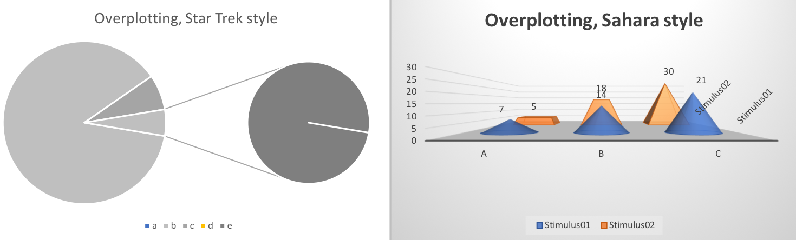
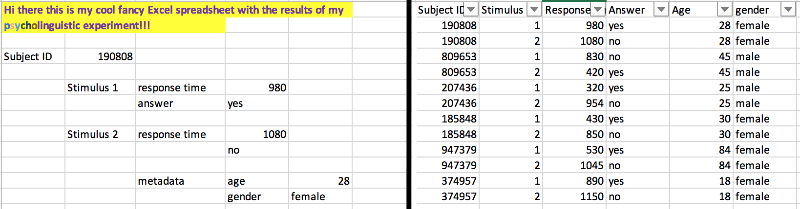
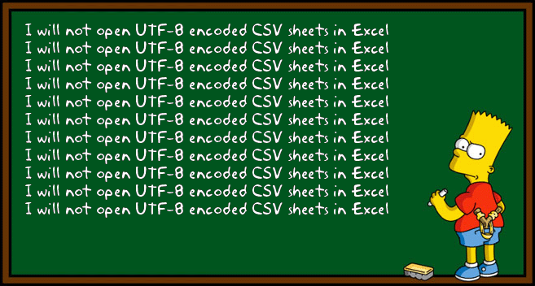
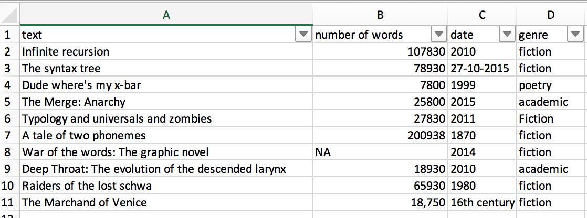

## Overview

> 1. Choosing the "right" plot
> 2. How to create a plot
> 3. How to create a plot that's not totally ugly
> 4. Best practices and deadly sins of data visualization

---

## Before we start...

> - Please open R and, ideally, RStudio.

> - Please open the Googledoc.

---

## Before we start...

> - Feel free to interrupt me at any time!
> - There's A LOT of code in this presentation...

---

## Before we start...

- Feel free to interrupt me at any time!
- There's A LOT of code in this presentation...

```{r demo01, echo=TRUE, eval=FALSE}
this <- is(what, code) {
  looks, like
}
```

---

## Before we start...

- Feel free to interrupt me at any time!
- There's A LOT of code in this presentation...

```{r demo1, echo=TRUE, eval=FALSE}
this <- is(what, code) {
  looks, like
}
```

> - You don't have to type all of the code, it's more important that you understand the conceptual background first.
> - There will be some hands-on exercises.

--- bg:#ffffbf

## Before we start...

- Feel free to interrupt me at any time!
- There's A LOT of code in this presentation...

```{r demo2, echo=TRUE, eval=FALSE}
this <- is(what, code) {
  looks, like
}
```

- You don't have to type all of the code, it's more important that you understand the conceptual background first.
- There will be some hands-on exercises.
- Also, there will be some slides with more advanced stuff (and yellow background).

---

```{r setup, include=FALSE}
library(knitr)
opts_chunk$set(global.par=TRUE) 
opts_knit$set(global.par = TRUE)
```

## Why visualize?

> - **For yourself**
    > - Exploring your data
    > - detecting outliers
    > - checking assumptions of statistical tests or models (e.g. are the data normally distributed?)
    > - etc.
    

> - **For others**
    > - Showing your findings in a clear and efficient way
    > - Graphs tend to be more reader-friendly than tables...
    > - ... and *much* more reader-friendly than long inline lists!

---

## Choosing the "right" plot

> - What kind of data are you dealing with?
> - What is your research question?

---

## Types of data: Levels of measurement

> - categorical variables:
    - **nominal variable**: e.g. married, not married, divorced; Swiss, German, French...
      - Subtype: **binary variable**, e.g. living/dead
    - **ordinal variable**: e.g. gold medal, silver medal, bronze medal
> - metric variables:
    - **interval variable**: e.g. temperature (Celsius, Fahreneit)
    - **ratio variable**: e.g. weight, temperature (Kelvin)
    - (**absolute / count variable**: natural unit, e.g. number of students, age)

---

## Alternative visualizations

- What kind of variable are we dealing with here?
- Which visualization seems most appropriate to you?

```{r echo = FALSE, warning=FALSE, message=FALSE, dpi = 300, fig.width=20, fig.height=9, out.width='100%', out.height='100%', fig.align="center"}

# set parameters to get bigger labels by default
par(cex = 2)
par(cex.axis = 2)
par(cex.lab = 2)
par(cex.main = 2)

fword <- read.csv("../fword.csv")
fword$rel <- fword$fuck / fword$total
fword <- fword[order(fword$Time),]

par(mfrow = c(1,3))
par(bg="transparent")
par(mar = c(3, 4, 3, 2) + 0.1)
pie(fword$rel / sum(fword$rel), labels = fword$Time,
    main = "Frequency of the f word in the BNC", cex.main = 2, cex = 2)
text(-0.3,-0.1, "68 %", cex = 2)
text(0.4, 0.4, "23 %", cex = 2)
text(-0.11,0.6, "8%", cex = 2)

par(mar = c(5, 6, 4, 3) + 0.1)
barplot(fword$rel*1000000, names.arg = fword$Time, cex.names = 2,
        main = "Frequency of the f-word in the BNC",
        ylab = "Frequency per 1 mio. words", cex.lab = 2, cex.main = 2)

plot(1:3, fword$rel*1000000, ylim=c(0,50), type = "b", pch = 18, lwd=2,
     xaxt="n", ylab="Frequency per 1 mio. words", xlab="Time period", cex.axis = 2, cex.lab = 2,
     main = "Frequency of the f-word in the BNC", cex.main = 2, cex = 2)
axis(1, at = c(1:3), labels = fword$Time, cex.axis=2)
par(mfrow = c(1,1))
par(mar = c(5, 4, 4, 2) + 0.1)

```

---

## Alternative visualizations

- What kind of variable are we dealing with here?
- Which visualization seems most appropriate to you?

```{r echo = FALSE, dpi = 300, warning = FALSE, message = FALSE, fig.width=20, fig.height=9, out.width='100%', out.height='100%', fig.align="center"}

library(reshape2)

heights <- data.frame(men = c(175, 180, 171, 175, 185), women = c(179, 160, 165, 170, 174))
heights2 <- melt(heights)

par(mfrow = c(1,3))
par(bg="transparent")
par(mar = c(5, 6, 4, 3) + 0.1)
barplot(c(mean(heights$men), mean(heights$women)), space = 0, col = c("darkgrey", "grey"),
        main = "Height of 10 students", ylab = "Height in cm", xlab = "Gender",
        names.arg = c("men", "women"), cex.lab=2, cex.names = 2, cex.main=2, cex.axis=2)
cis_men <- t.test(heights$men, conf.level = 0.95)$conf.int[1:2]
cis_women <- t.test(heights$women, conf.level = 0.95)$conf.int[1:2]
par(xpd=T)
lines(x = c(0.5,0.5), y = cis_men)
lines(x = c(1.5,1.5), y = cis_women)
par(xpd=F)

plot(x = heights2$value, y = heights2$variable, pch=20, cex=3,
     ylim = c(0.5,2.5), yaxt="n", col = c(rep("darkgreen", 5), rep("blue", 5)), ylab="", xlab="Height",
     cex.axis=2, cex.lab=2, cex.main=2, main="Height of 10 students")
abline(h = 1, col = "lightgrey", lty=3)
abline(h = 2, col = "lightgrey", lty=3)
points(x = heights2$value, y = heights2$variable, pch=20, cex=3,
       col = c(rep("darkgreen", 5), rep("blue", 5)))
axis(2, at = c(1:2), labels = c("women", "men"), las = 2, cex.axis = 2)


boxplot(heights, main = "Height of 10 students", ylab = "Height", xlab = "Gender",
        cex = 2, cex.lab = 2, cex.main = 2, cex.axis = 2)
par(mfrow=c(1,1))

```

---

## Alternative visualizations

- What kind of variable are we dealing with here?
- Which visualization seems most appropriate to you?

```{r echo = FALSE, dpi = 300, warning = FALSE, message = FALSE, fig.width=20, fig.height=9, out.width='100%', out.height='100%', fig.align="center"}

benzin <- read.csv("../benzinpreis.csv")

par(cex = 2)
par(cex.axis = 2)
par(cex.lab = 2)
par(cex.main = 3)
par(mfrow = c(1,3))
par(bg = "transparent")
par(mar = c(5, 5, 4, 2) + 0.1)
plot(benzin[1:9,]$Year, benzin[1:9,]$Price, type = "b", lwd = 3, pch = 20,
     ylab="Price in Cents", xlab="Year", main = "Mean petrol price in Germany")

plot(benzin$Year, benzin$Price, type = "b", lwd = 3, pch = 20,
     ylab="Price in Cents", xlab="Year", main = "Mean petrol price in Germany")

plot(benzin$Year, benzin$Price, type = "l", lwd = 3, pch = 20,
     ylab="Price in Cents", xlab="Year", main = "Mean petrol price in Germany",
     ylim = c(-500,1000))

par(mfrow = c(1,1))

```

---

## Alternative Visualizations

- from http://www.stubbornmule.net/2010/10/visualizing-smoking-risk/
- "Risk Characterization Theatre" from Rifkin & Bouwer (2007)

<iframe src="fig/rct.html"></iframe>

---
## Alternative Visualizations

- from http://www.stubbornmule.net/2010/10/visualizing-smoking-risk/

</img>

---

## Nominal variable: Alternative visualizations

- Who among the expeRts is a native speaker of English?

```{r echo = FALSE, dpi = 300, fig.width=20, fig.height=9, out.width='100%', out.height='100%', fig.align="center"}

nsp <- data.frame(name = c("Ulrike", "Dylan", "Joe", "Stefan"),
                  values = c(0, 1, 1, 0))

m <- matrix(c(1,1,2,2,3), ncol=5)
layout(m)
par(mar=c(6,4,2,2))
par(bg="transparent")
# par(mfrow=c(1,3))
barplot(as.numeric(nsp$values), names.arg = nsp$name, yaxt="n", cex.names = 2)
axis(2, at = c(0,1), labels = c("no", "yes"), las = 2, cex.axis = 2)

plot(1:4, nsp$values, xaxt="n", yaxt="n", type = "b", pch = 18, cex = 2, ylim=c(-0.1, 1.1),
     ylab="", xlab="Person", cex.lab=2)
axis(2, at = c(0,1), labels = c("no", "yes"), las = 2, cex.axis=2)
axis(1, at = c(1:4), labels = c("Ulrike", "Joe", "Dylan", "Stefan"), cex.axis=2)

plot(1:5, 1:5, type = "n", xlim = c(1,1.7), ylab="", xlab="",  yaxt="n", xaxt="n")
text(rep(1, 4), seq(1.5, 4.5, 1), c("Ulrike", "Joe", "Dylan", "Stefan"), adj = 0, cex = 3)
text(1.5, 2.5, bquote(symbol("\326")), col = "darkgreen", cex = 3.5)
text(1.5, 3.5, bquote(symbol("\326")), col = "darkgreen", cex = 3.5)
par(mfrow=c(1,1))
par(mar = c(5, 4, 4, 2) + 0.1)

```

---

## The plot as a metaphor

"The essence of a graphic display is that a set of numbers having both magnitudes and an order are represented by an appropriate visual metaphor - the magnitude and order of the metaphorical representation match the numbers." (Wainer 1984: 139)

</img>

---

## Best practice for reporting and displaying data

> - Most importantly: **Know your data!**
> - When reporting percentages, also report the denominator (i.e. the size of your sample)
> - Example: "50% of academics are alcoholics" - it makes a difference whether your sample size is 2 or 2,000.
> - When reporting comparisons of absolute frequencies, double-check if your samples are comparable.
> - Example: "255 women agree that cats are adorable, but only 5 men." - it makes a difference whether your sample consists of 300 women and 300 men or of 300 women and 10 men.
> - When reporting means, also report standard deviations.
> - Example: [5,5,5,5,995] has the same mean as [1,180,300,223,146].

---

## Best practice (Tufte 2001, Freeman et al. 2009)

> - Show the data
> - Avoid distorting the data
> - Keep "Ink-to-data ratio" as low as possible
> - Use meaningful x and y labels
> - Avoid overplotting (e.g. 3-dimensional plots when only 2 dimensions are displayed)

---

## Beware of overplotting!

</img>
</img>

---

## Further tips

- If there is no natural order in your data, order them by value
<br />

```{r echo = FALSE, dpi = 300, warning = FALSE, fig.width=12, fig.height=5, out.width='100%', out.height='100%', fig.align="center"}


set.seed(100)
values <- sample(1:100, 10)
countries <- c("France", "Germany", "Switzerland", "USA", "Mordor", "Italy", "Brazil", "Egypt", "Austria", "Japan")

cdf <- data.frame(countries = countries, values = values)
cdf <- cdf[rev(order(cdf$countries)),]
cdf2 <- cdf[order(cdf$values),]

par(mfrow = c(1,2))
par(mar =  c(5, 6, 4, 2) + 0.1)
barplot(cdf$values, horiz = T, names.arg = cdf$countries, las = 2, xaxt="n",
        main = "Some random stuff", cex.main = 2, cex.lab = 1, cex.names = 1)
axis(1, at = seq(0,70,10), labels = seq(0,70,10), cex.axis = 1)

barplot(cdf2$values, horiz = T, names.arg = cdf2$countries, las = 2, xaxt="n",
        main = "Some random stuff", cex.main = 2, cex.lab = 1, cex.names = 1)
axis(1, at = seq(0,70,10), labels = seq(0,70,10), cex.axis = 1)
par(mfrow = c(1,1))
par(mar =  c(5, 4, 4, 2) + 0.1)

```

---

## Further tips

- Don't cut the y axis unless there are good conceptual reasons to do so.

```{r echo = FALSE, dpi = 300, warning = FALSE, fig.width=10, fig.height=5, out.width='100%', out.height='100%', fig.align="center"}

par(mfrow = c(1,2))
barplot(c(100, 110), names.arg = c("boys", "girls"), ylab = "Score", main = "High school results",
        cex.arg = 1, cex.main = 1, cex.lab = 1, cex.axis = 1, cex.names = 1)
barplot(c(100, 110), names.arg = c("boys", "girls"), ylab = "Score", main = "High school results",
        ylim = c(90,110), xpd = F, cex.arg = 1, cex.main = 1, cex.lab = 1, cex.axis = 1, cex.names = 1)
par(mfrow = c(1,1))

```

---

## From data to plot

<br />
</img>


---

## Preparing data for visualization

- Use "tidy data": 
  - One variable per column
  - One observation per row

<br />
</img>

---

## "Long" vs. "wide" format

- wide format: repeated responses in a single row
- long format: repeated responses in different rows

</img>

---

## Preparing data for visualization

- Golden rule: **Don't be sloppy with your data!**

</img>

---

## Preparing data for visualization

- Data are often messy: What's wrong here?

</img>

---

## Plot types

```{r echo = FALSE, dpi = 300, warning = FALSE, fig.width=12, fig.height=10, out.width='100%', out.height='100%', fig.align="center"}

# change parameters
par(cex.axis = 1)
par(cex.names = 1)
par(cex.lab = 1)

# experience data
r <- data.frame(experience = c(30,50,100,200,365,400,500,600,700,600,800,700,1000,900,1200,1300,1500,1800,1700,1600,1500,1800,1750,1435, 1985),
                time = c(100,90,50,40,50,35,120,60,35,30,45,50,65,57,20,10,15,20,10,10,7,9,5,3,3))

# Harry Potter data
hp <- read.delim("../harrypotter_coca.txt", quote="")
coca_meta <- read.csv("../coca_metadata.csv")
coca_meta <- coca_meta[-nrow(coca_meta),]
harry <- dplyr::full_join(as.data.frame(table(hp$Year)), coca_meta, by=c("Var1" = "YEAR"), all=T)
harry$Freq <- ifelse(is.na(harry$Freq), 0, harry$Freq)
harry$rel <- harry$Freq / harry$TOTAL
harry$Var1 <- as.numeric(harry$Var1)
harry <- harry[order(harry$Var1),]


# Lord of the rings data
lotr <- read.delim("../lotr_coca.txt", quote = "") 
hplotr <- rbind(lotr, hp)

# plots

par(mfrow = c(3,3))
par(cex.main = 2)
par(bg = 'transparent')
plot(r, xlab = "Experience with R (days of exposure)", ylab = "Time needed to create a plot (in min.)", pch = 20,
     cex = 2, main = "Scatterplot")

hist(r$time, main = "Histogram", xlab = "Time needed to create a plot (in min.)", prob = F)
# hist(r$time, main = "Histogram", xlab = "Time needed to create a plot (in min.)", prob = T)
# par(xpd=F)
# lines(density(r$time, adjust = 2))


barplot(c(mean(heights$men), mean(heights$women)), space = 0, col = c("darkgrey", "grey"),
        main = "Barplot", ylab = "Height in cm", xlab = "Gender",
        names.arg = c("men", "women"), cex.main=2)
cis_men <- t.test(heights$men, conf.level = 0.95)$conf.int[1:2]
cis_women <- t.test(heights$women, conf.level = 0.95)$conf.int[1:2]
par(xpd=T)
lines(x = c(0.5,0.5), y = cis_men)
lines(x = c(1.5,1.5), y = cis_women)
par(xpd = F)
barplot(prop.table(table(hplotr$Query.item, hplotr$Genre), mar = 2), main = "Stacked Barplot",
        ylab = "Relative Frequency", xlab = "Genre")

plot(harry$Var1, harry$rel*1000000, type = "l", 
     xlab = "Year", ylab = "Frequency per 1000000 words", main = "Lineplot")

boxplot(heights, main = "Boxplot", ylab = "Height", xlab = "Gender", cex.main = 2)

par(mfrow = c(1,1))


```

---

## Scatterplots: When to use a scatterplot

> - show / explore correlations between two variables
> - metric data on both the x- and the y-axis

---

## Creating a scatterplot

- First, let's create some data:

```{r echo= TRUE}
x <- c(1,3,3,4,7,8)
y <- c(1,1,3,9,8,5)
```

- ... and create a simple plot:

```{r echo= TRUE, eval = FALSE}

plot(x,y)

```

---

## Creating a scatterplot

```{r echo = FALSE, dpi = 300, warning = FALSE, fig.width=5, fig.height=5, out.width='50%', out.height='50%', fig.align="center"}

par(mar = c(5, 6, 4, 2) + 0.1)
plot(x,y, main = "Anatomy of a plot")

```

---

## Creating a scatterplot

```{r echo = FALSE, dpi = 300, warning = FALSE, fig.width=5, fig.height=5, out.width='50%', out.height='50%', fig.align="center"}

par(mar = c(5, 6, 4, 2) + 0.1)
plot(x,y, main = "Anatomy of a plot")
par(xpd=F)
rect(xleft = -10, xright = 10, ybottom =  -10, ytop = 10, col = rgb(1,1,0, alpha =.5))
text(4.5,5, "plot region")

```

---

## Creating a scatterplot

```{r echo = FALSE, dpi = 300, warning = FALSE, fig.width=5, fig.height=5, out.width='50%', out.height='50%', fig.align="center"}

par(mar = c(5, 6, 4, 2) + 0.1)
par(bg = "grey90")
plot(x,y, main = "Anatomy of a plot")
par(xpd=F)
rect(xleft = -10, xright = 10, ybottom =  -10, ytop = 10, col = rgb(1,1,0, alpha =.5))
text(4.5,5, "plot region")
par(xpd=T)
text(-1, 0, "figure \n region")
par(xpd=F)
par(bg = "transparent")
par(mar = c(5, 4, 4, 2) + 0.1)
```

---

## Creating a scatterplot

```{r echo = FALSE, dpi = 300, warning = FALSE, fig.width=5, fig.height=5, out.width='50%', out.height='50%', fig.align="center"}

par(mar = c(5, 6, 4, 2) + 0.1)
par(bg = "grey90")
plot(x,y, main = "Anatomy of a plot")
par(xpd=F)
rect(xleft = -10, xright = 10, ybottom =  -10, ytop = 10, col = rgb(1,1,0, alpha =.5))
text(4.5,5, "plot region")
par(xpd=T)
text(-1, 0, "figure \n region")
lines(x = c(-10, 0.7), y = c(9,9))
text(-1,8.3, "Margins")
par(xpd=F)
par(bg = "transparent")
par(mar = c(5, 4, 4, 2) + 0.1)
```

---

## Customizing a scatterplot: Labels

```{r echo = TRUE, dpi = 300, warning = FALSE, fig.width=5, fig.height=5, out.width='40%', out.height='40%', fig.align="center"}
plot(x, y, xlab = "xlab", ylab = "ylab", main = "main")
```

---

## Customizing a scatterplot: Colors

```{r echo = TRUE, dpi = 300, warning = FALSE, fig.width=5, fig.height=5, out.width='40%', out.height='40%', fig.align="center"}
plot(x, y, xlab = "xlab", ylab = "ylab", main = "main", col = "red")
```

---

## Customizing a scatterplot: Colors

```{r echo = TRUE, dpi = 300, warning = FALSE, fig.width=5, fig.height=5, out.width='40%', out.height='40%', fig.align="center"}
plot(x, y, xlab = "xlab", ylab = "ylab", main = "main", col = rgb(1, 0, 0, alpha = 0.5))
```

---

## Some notes on color

- keep in mind that what you see on your screen is not always what you get on a printer or projector
- → make sure that your colors are not too similar!
- use color-blind friendly color schemes
- avoid red-green contrasts
- in many cases, it makes sense to combine color with other aesthetics like shape or line type

---


## Some notes on color

- If you work with many different colors in a plot, check out R's color palettes, e.g. `rainbow`, `heat.colors`, `terrain.colors`
- Another useful resource is the `RColorBrewer` package with a number of color-blind friendly palettes (argument `colorblindFriendly = TRUE`)

```{r echo = FALSE, dpi = 300, warning = FALSE, fig.width=9, fig.height=6, out.width='60%', out.height='60%', fig.align="center"}
RColorBrewer::display.brewer.all(colorblindFriendly = T)
par_cur <- par()
par(mar = c(1,1,3.5,1))
title("Color-blind friendly \n Brewer Pal color palettes", cex = 1)
par(par_cur)

```

---

## Customizing a scatterplot: Text

```{r echo = TRUE, dpi = 300, warning = FALSE, fig.width=5, fig.height=5, out.width='40%', out.height='40%', fig.align="center"}
plot(x, y, xlab = "xlab", ylab = "ylab", main = "main", col = "red")
text(x = 5, y = 5,"Note the the added text! \n In a different color!", col = "blue")
```

---

## Customizing a scatterplot: Shapes

```{r echo = TRUE, dpi = 300, warning = FALSE, fig.width=5, fig.height=5, out.width='40%', out.height='40%', fig.align="center"}
plot(x, y, xlab = "xlab", ylab = "ylab", main = "main", col = "red",
     pch = 20)
```

---

## Customizing a scatterplot: Shapes - and sizes

```{r echo=FALSE}
par(mar = c(2,4,4,2))
```

```{r echo = TRUE, dpi = 300, warning = FALSE, fig.width=5, fig.height=5, out.width='40%', out.height='40%', fig.align="center"}
plot(x, y, xlab = "xlab", ylab = "ylab", main = "main", col = "red",
     pch = "\u263A", cex = 2)
```
- Any single character can be used.

```{r echi=FALSE}
par(mar = c(5, 4, 4, 2) + 0.1)
```

---

## Customizing a scatterplot: Shapes

```{r echo = TRUE, dpi = 300, warning = FALSE, fig.width=7, fig.height=3, out.width='50%', out.height='50%', fig.align="center"}
par_cur <- par() # save default graphics parameters
par(mar = c(1,1,1,1)) # change margins
plot(1:20, rep(10,20), pch = c(1:20), cex=1.5, ylab="", xlab="", yaxt="n", xaxt="n")
text(1:20, rep(8.5,20), labels = 1:20)
par(par_cur) # restore default graphics parameters
```

---

## Customizing a scatterplot: x and y limits

```{r echo = TRUE, dpi = 300, warning = FALSE, fig.width=5, fig.height=5, out.width='40%', out.height='40%', fig.align="center"}
plot(x, y, xlab = "xlab", ylab = "ylab", main = "main", col = "red",
     xlim = c(0, max(x)),
     ylim = c(0, max(y)))

```

---

## Customizing a scatterplot: grid

```{r echo=FALSE, warning = FALSE, message=FALSE}
par_cur <- par()
par(mar = c(1.8,2,2,2))
```

```{r echo = TRUE, dpi = 300, warning = FALSE, fig.width=5, fig.height=5, out.width='25%', out.height='25%', fig.align="center"}
plot(x, y, xlab = "xlab", ylab = "ylab", main = "main", col = "red", 
     xlim = c(0, max(x)), ylim = c(0, max(y)))
grid(nx = 0, ny=10)

```

- **Note:** default color is "lightgray", which is often invisible in print
- In many cases grids are a waste of ink.

```{r echo=FALSE, warning = FALSE, message=FALSE}
par(par_cur)
```

---

## Customizing a scatterplot: cex parameters

```{r echo = TRUE, dpi = 300, warning = FALSE, fig.width=5, fig.height=5, out.width='25%', out.height='25%', fig.align="center"}
plot(x, y, 
     # cex = 2,
     # cex.axis = 2,
     xlab = "xlab", ylab = "ylab", # cex.lab = 2,
     main = "main", # cex.main = 2,
     xlim = c(0, max(x)), ylim = c(0, max(y)))

```

---

## Customizing a scatterplot: cex parameters

```{r echo = TRUE, dpi = 300, warning = FALSE, fig.width=5, fig.height=5, out.width='25%', out.height='25%', fig.align="center"}
plot(x, y, 
     cex = 2,
     # cex.axis = 2,
     xlab = "xlab", ylab = "ylab", # cex.lab = 2,
     main = "main", # cex.main = 2,
     xlim = c(0, max(x)), ylim = c(0, max(y)))

```

---

## Customizing a scatterplot: cex parameters

```{r echo = TRUE, dpi = 300, warning = FALSE, fig.width=5, fig.height=5, out.width='25%', out.height='25%', fig.align="center"}
plot(x, y, 
     cex = 2,
     cex.axis = 2,
     xlab = "xlab", ylab = "ylab", # cex.lab = 2,
     main = "main", # cex.main = 2,
     xlim = c(0, max(x)), ylim = c(0, max(y)))

```

---

## Customizing a scatterplot: cex parameters

```{r echo = TRUE, dpi = 300, warning = FALSE, fig.width=5, fig.height=5, out.width='25%', out.height='25%', fig.align="center"}
plot(x, y, 
     cex = 2,
     cex.axis = 2,
     xlab = "xlab", ylab = "ylab", cex.lab = 2,
     main = "main", cex.main = 2,
     xlim = c(0, max(x)), ylim = c(0, max(y)))

```

---

## Adding datapoints from another dataframe

```{r echo = TRUE, dpi = 300, warning = FALSE, fig.width=5, fig.height=5, out.width='40%', out.height='40%', fig.align="center"}
plot(x, y, col = "red", pch = 20)
points(x = c(4, 5, 6), y = c(2,6,8), col = "green", pch = 2)
```

---

## Adding a legend

```{r echo = TRUE, dpi = 300, warning = FALSE, fig.width=5, fig.height=5, out.width='25%', out.height='25%', fig.align="center"}
plot(x, y, col = "red", pch = 20)
points(x = c(4, 5, 6), y = c(2,6,8), col = "green", pch = 2)
legend ("topleft", 
        inset = c(0.01,0.01),    # distance from the margins
        pch = c(20,2),           # the two point characters we used
        col = c("red", "green"), # the two colors we used
        legend = c("red dots", "green triangles"))
```

---

## Adding a regression line

- In scatterplots, you often don't see the wood for the trees
- So you might want to visualize a general trend
- To this end, you can add a regression line
- i.e. the straight line that is closest to all points

---

## Adding a regression line

- We use the `lm` function for generating the model and the `abline` function, which adds straight lines to a plot

```{r echo = TRUE, dpi = 300, warning = FALSE, fig.width=5, fig.height=5, out.width='30%', out.height='30%', fig.align="center"}

plot(x, y)
model <- lm(y ~ x)
abline(model)

```

---

## Adding a lo(w)ess curve

- lowess/loess: locally weighted polynomial regression models
- "The basic idea underlying smoothers is to use the observations in a given span
(or bin) of values of X to calculate the average increase in Y . You then move this
span from left to right along the horizontal axis, each time calculating the new
increase in y." (Baayen 2008: 34)

---

## Adding a lo(w)ess curve

```{r echo = FALSE}
par(mfrow = c(1,2))
```

```{r echo = TRUE, dpi = 300, warning = FALSE, fig.width=10, fig.height=5, out.width='70%', out.height='70%', fig.align="center"}


plot(x,y, main = "lowess")
lines(lowess(x, y))
scatter.smooth(x,y, main = "loess")

```

```{r echo = FALSE}
par(mfrow = c(1,1))
```

---

## From scatterplot to lineplot

```{r echo = TRUE, dpi = 300, warning = FALSE, fig.width=5, fig.height=5, out.width='50%', out.height='50%', fig.align="center"}
plot(x, y, type = "l")

```

---

## From scatterplot to lineplot

```{r echo = TRUE, dpi = 300, warning = FALSE, fig.width=5, fig.height=5, out.width='50%', out.height='50%', fig.align="center"}
plot(x, y, type = "b")

```

---

## From scatterplot to lineplot: Line types

- Line types can be customized using the `lty` parameter:

```{r echo = TRUE, dpi = 300, warning = FALSE, fig.width=5, fig.height=5, out.width='40%', out.height='40%', fig.align="center"}
plot(x, y, type = "b", lty = 2)
lines(x = c(2:7), y = c(4:9), lty = 3, col = "darkgrey")
```

---

## When to use a lineplot

- Lineplots are useful for showing e.g. change over time
- Count variable on y-axis, (at least) ordinal variable on x-axis
- Why should we avoid nominal variables on the x-axis?

---

## When to use a lineplot

- Lineplots are useful for showing e.g. change over time
- Count variable on y-axis, (at least) ordinal variable on x-axis
- Why should we avoid nominal variables on the x-axis?

```{r echo = FALSE, dpi = 300, warning = FALSE, fig.width=5, fig.height=5, out.width='40%', out.height='40%', fig.align="center"}

plot(c(1:4), c(2.41, 3.51, 2.9, 3.1), type = "b", pch=20, xaxt="n", 
     xlab = "Child", ylab = "TTR", main = "Type-Token-Ratio of four 3-year-olds", cex.main = 1)
axis(1, at = c(1:4), labels = c("Harry", "Gary", "Larry", "Jerry"))

```

---

## Hands-on task: Creating a scatterplot

- Use `read.csv` to read in the dataframe height_weight.csv
- Plot height against weight.

---

## Hands-on task: Creating a scatterplot

```{r echo = TRUE, dpi = 300, warning = FALSE, fig.width=5, fig.height=5, out.width='35%', out.height='35%', fig.align="center"}

hw <- read.csv("examples/height_weight.csv")
plot(hw$height, hw$weight, 
     xlab = "Height", ylab = "Weight", main = "Height~Weight")
model_hw <- lm(hw$weight~hw$height)
abline(model_hw, col = "darkgrey", lty = 2)

```

---

## Hands-on task: Creating a more complex scatterplot

- Use `read.csv` to read in the dataframe Pokemon.csv
- Plot height_m against weight_kg.
- Use the `col` parameter to show the color of each Pokémon, as indicated in the "Color" column.
- Use the `pch` parameter to show the form of each Pokémon, as indicated in the "Form" column.
- Hint: For the `pch` part, first look what happens when you try `as.numeric(pok$Form)`
- Finally, add a regression line to the plot.

---

## Hands-on task: Creating a more complex scatterplot

```{r echo = TRUE, eval = FALSE}

# read data
pok <- read.csv("examples/Pokemon.csv")

# plot
plot(pok$Height_m, pok$Weight_kg, col = pok$Color, pch = as.numeric(pok$Form),
    xlab="Height", ylab="Weight", main = "Height~Weight, Pokémon")
model_pok <- lm(pok$Weight_kg~pok$Height_m)
abline(model_pok)

```

---

## Hands-on task: Creating a more complex scatterplot

```{r echo = FALSE, dpi = 300, warning = FALSE, fig.width=5, fig.height=5, out.width='50%', out.height='50%', fig.align="center"}

# read data
pok <- read.csv("examples/Pokemon.csv")

# plot
plot(pok$Height_m, pok$Weight_kg, col = pok$Color, pch = as.numeric(pok$Form),
    xlab="Height", ylab="Weight", main = "Height~Weight, Pokémon")
model_pok <- lm(pok$Weight_kg~pok$Height_m)
abline(model_pok)

```

---

## Creating a barplot

- Barplots are useful to show counts of categorical variables (e.g. number of men vs. number of women in parliament)...
- ...or summary statistics (usually: means) of metric variables across different categories (e.g. mean height of humans vs. Klingons)
- But beware: Bar plots can *hide* information, cf. #barbarplots ("Friends don't let friends do bar charts")

```{r echo = FALSE, dpi = 300, warning = FALSE, fig.width=15, fig.height=5, out.width='70%', out.height='70%', fig.align="center"}

par(mfrow = c(1,3))
barplot(c(150, 75), names.arg = c("women", "men"), xlab = "Gender", ylab = "Absolute number",
        main = "Men and women \n in Targaryen parliament", cex.main = 1.5)
barplot(c(171,195), names.arg = c("human", "Klingon"), xlab = "Species", ylab = "Mean height",
        main = "Mean height of \n humans vs. Klingons", cex.main = 1.5)
barplot(c(171,195), names.arg = c("human", "Klingon"), xlab = "Species", ylab = "Mean height",
        main = "Mean height of \n humans vs. Klingons", cex.main = 1.5,
        ylim = c(160,196), xpd = F)
par(mfrow = c(1,1))

```

---

## Creating a barplot

- Main argument of the `barplot()` function is `height`
- This can be a vector or a matrix
- Let's try it out:

```{r echo = TRUE, eval = FALSE}
# define a vector
bar_heights <- c(50, 80)
barplot(bar_heights)
```

```{r echo = FALSE}
# define a vector
bar_heights <- c(50, 80)
```

---

## Creating a barplot

- The labels of the bars can be specified using `names.arg`:

```{r echo = TRUE, dpi = 300, warning = FALSE, fig.width=5, fig.height=5, out.width='40%', out.height='40%', fig.align="center"}

barplot(bar_heights, names.arg = c("stuff", "more\nstuff"))

```

---

## Creating a barplot

- The other arguments are largely the same as in the case of scatterplots:

```{r echo = TRUE, dpi = 300, warning = FALSE, fig.width=5, fig.height=5, out.width='40%', out.height='40%', fig.align="center"}

barplot(bar_heights, names.arg = c("stuff", "more\nstuff"),
        main = "I'm a barplot", xlab = "I'm the x label", ylab = "I'm the y label",
        cex.main = 2, cex.lab = 2, cex.axis = 2, cex.names = 2)

```

---

## Creating a barplot

- The `space` argument defines the space between bars, default is 0.2 if `height` is a vector

```{r echo = FALSE, dpi = 300, warning = FALSE, fig.width=5, fig.height=5, out.width='50%', out.height='40%', fig.align="center"}

barplot(bar_heights, names.arg = c("stuff", "more\nstuff"),
        main = "I'm a barplot", xlab = "I'm the x label", ylab = "I'm the y label",
        border = "lightgrey")

```

---

## Creating a barplot

- The `space` argument defines the space between bars, default is 0.2 if `height` is a vector

```{r echo = FALSE, dpi = 300, warning = FALSE, fig.width=5, fig.height=5, out.width='50%', out.height='40%', fig.align="center"}

barplot(bar_heights, names.arg = c("stuff", "more\nstuff"),
        main = "I'm a barplot", xlab = "I'm the x label", ylab = "I'm the y label",
        border = "lightgrey")
text(c(0.7, 1.9), c(15, 15), 
     labels = c("0.5 + 0.2 \n = 0.7", "0.7 + 1 + 0.2 \n = 1.9"))

```

---

## Creating a barplot

- The `space` argument defines the space between bars, default is 0.2 if `height` is a vector

```{r echo = FALSE, dpi = 300, warning = FALSE, fig.width=5, fig.height=5, out.width='50%', out.height='40%', fig.align="center"}

barplot(bar_heights, names.arg = c("stuff", "more\nstuff"),
        main = "I'm a barplot", xlab = "I'm the x label", ylab = "I'm the y label",
        border = "lightgrey")
text(c(0.7, 1.9), c(15, 15), 
     labels = c("0.5 + 0.2 \n = 0.7", "0.7 + 1 + 0.2 \n = 1.9"))
arrows(x0=0.2,x1=1.2,y0=40,y1=40, code = 3, col = "red")
text(0.2, 30, "0.2", col = "red")
text(0.7, 30, "standard \n width: 1", col = "red")
text(1.2, 30, "1.2", col = "red")

```

---

## Creating a barplot

- The `space` argument defines the space between bars, default is 0.2 if `height` is a vector

```{r echo = FALSE, dpi = 300, warning = FALSE, fig.width=5, fig.height=5, out.width='50%', out.height='40%', fig.align="center"}

barplot(bar_heights, names.arg = c("stuff", "more\nstuff"),
        main = "I'm a barplot", xlab = "I'm the x label", ylab = "I'm the y label",
        border = "lightgrey")
text(c(0.7, 1.9), c(15, 15), 
     labels = c("0.5 + 0.2 \n = 0.7", "0.7 + 1 + 0.2 \n = 1.9"))
arrows(x0=0.2,x1=1.2,y0=40,y1=40, code = 3, col = "red")
text(0.2, 30, "0.2", col = "red")
text(0.7, 30, "standard \n width: 1", col = "red")
text(1.2, 30, "1.2", col = "red")
arrows(x0 = 1.2, x1 = 1.4, y0 = 50, y1 = 50, col = "blue", code = 3, length = 0.05)
text(1.3, 55, "+0.2", col = "blue")


```

---

## Creating a barplot

- The `space` argument defines the space between bars, default is 0.2 if `height` is a vector

```{r echo = FALSE, dpi = 300, warning = FALSE, fig.width=5, fig.height=5, out.width='50%', out.height='40%', fig.align="center"}

barplot(bar_heights, names.arg = c("stuff", "more\nstuff"),
        main = "I'm a barplot", xlab = "I'm the x label", ylab = "I'm the y label",
        border = "lightgrey")
text(c(0.7, 1.9), c(15, 15), 
     labels = c("0.5 + 0.2 \n = 0.7", "0.7 + 1 + 0.2 \n = 1.9"))
arrows(x0=0.2,x1=1.2,y0=40,y1=40, code = 3, col = "red")
text(0.2, 30, "0.2", col = "red")
text(0.7, 30, "standard \n width: 1", col = "red")
text(1.2, 30, "1.2", col = "red")
arrows(x0 = 1.2, x1 = 1.4, y0 = 50, y1 = 50, col = "blue", code = 3, length = 0.05)
text(1.3, 55, "+0.2", col = "blue")
arrows(x0=1.4, x1=2.4,y0=60,y1=60, code = 3, col = "darkgreen")
text(1.4, 70, "1.4", col = "darkgreen")
text(2.4, 70, "2.4", col = "darkgreen")
text(1.9, 70, "standard \n width: 1", col = "darkgreen")


```

---

## Creating a barplot

- Knowing the width of bars and the space between them is important if you want to add text
- To simplify the task, you can set `space = 0` 

```{r echo = TRUE, dpi = 300, warning = FALSE, fig.width=5, fig.height=5, out.width='25%', out.height='25%', fig.align="center"}

barplot(bar_heights / sum(bar_heights), # get relative frequencies
        names.arg = c("stuff", "more\nstuff"), space = 0)
text(x = c(0:1)+0.5,
     y = (bar_heights / sum(bar_heights)) - 0.05,
     labels = bar_heights)

```

--- bg:#ffffbf

## Creating a barplot

- Or you can use the magic of vector addition and multiplication
- `0.5:1.5` yields {0.5,1.5}, `0.2 * 1:2` yields {0.2, 0.4} (= 0.2 \* 1, 0.2 \* 2)

```{r echo = TRUE, dpi = 300, warning = FALSE, fig.width=5, fig.height=5, out.width='25%', out.height='25%', fig.align="center"}

barplot(bar_heights / sum(bar_heights), # get relative frequencies
        names.arg = c("stuff", "more\nstuff"))
text(x = (0.5:1.5)  + (0.2 * 1:2),
     y = (bar_heights / sum(bar_heights)) - 0.05,
     labels = bar_heights)

```

---

## Creating a barplot from a matrix

```{r echo = TRUE, dpi = 300, warning = FALSE, fig.width=5, fig.height=5, out.width='40%', out.height='40%', fig.align="center"}

bar_matrix <- matrix(c(2,4,5,4,3,3,7,6), nrow = 2)
bar_matrix

```

---

## Creating a barplot from a matrix

```{r echo = TRUE, dpi = 300, warning = FALSE, fig.width=5, fig.height=5, out.width='40%', out.height='40%', fig.align="center"}

barplot(bar_matrix)

```

---

## Generating a barplot from a matrix

```{r echo = TRUE, dpi = 300, warning = FALSE, fig.width=5, fig.height=5, out.width='40%', out.height='40%', fig.align="center"}

barplot(bar_matrix, beside = T)

```

---

## Creating a barplot

Hands-on example: action-sentence compatibility task

<iframe src="/Users/stefanhartmann/Dropbox/Privat/Deutsche Sprachgeschichte/Begleitmaterial/Begleitmaterial_Jan2018/Experimente/actionsentence/actionsentence.html"></iframe>

---

## Hands-on task: Creating a barplot

- Task: Read in file actionsentence.csv with `read.csv`
- Inspect the data using `head`, `str`, and `View`
- Subset the data: Omit rows with `direction == "distractor"`

---

## Hands-on task: Creating a barplot

```{r echo = TRUE, dpi = 300, warning = FALSE, fig.width=5, fig.height=5, out.width='50%', out.height='50%', fig.align="center"}
rt <- read.csv("examples/actionsentence.csv", fileEncoding = "UTF8")
rt <- subset(rt, direction != "distractor")
```

---

## Hands-on task: Creating a barplot

- No we want to show the means for "toward" and "away" sentences using a barplot.
- We want to abstract over the individual subjects, so it makes sense to transpose the table from wide to long format first.

``` {r melting, echo=TRUE, warning = FALSE, message = FALSE}

library(reshape2)
rt2 <- melt(rt, id.vars = c("ID", "sentence", "direction"))

```

---

## Hands-on task: Creating a barplot

- No we want to show the means for "toward" and "away" sentences using a barplot.
- We want to abstract over the individual subjects, so it makes sense to transpose the table from wide to long format first.

``` {r melting2, echo=TRUE, warning = FALSE, message = FALSE, eval = FALSE}

library(reshape2)
rt2 <- melt(rt, id.vars = c("ID", "sentence", "direction"))

# same result but with (imho) more complicated syntax: "gather" from tidyr package
library(tidyr)
rt3 <- gather(rt, variable, value, -ID, -sentence, -direction)
all(rt2==rt3) # cheks if all values are identical

```

---

## Hands-on task: Creating a barplot

- No we want to show the means for "toward" and "away" sentences using a barplot.
- We want to abstract over the individual subjects, so it makes sense to transpose the table from wide to long format first.

``` {r melting3, echo=TRUE, warning = FALSE, message = FALSE}

library(reshape2)
rt2 <- melt(rt, id.vars = c("ID", "sentence", "direction"))

# same result but with (imho) more complicated syntax: "gather" from tidyr package
library(tidyr)
rt3 <- gather(rt, variable, value, -ID, -sentence, -direction)
all(rt2==rt3) # cheks if all values are identical

```

---

## Hands-on task: Creating a barplot

```{r echo = TRUE}

# get mean values for "away" and "towards" subsets:
rt2_away <- subset(rt2, direction == "away")
rt2_toward <- subset(rt2, direction == "toward")

mean_away <- mean(rt2_away$value)
mean_toward <- mean(rt2_toward$value)

# combine both to one vector
rt_means <- c(mean_away, mean_toward)
rt_means

```

---

## Hands-on task: Creating a barplot

```{r echo = TRUE, dpi = 300, warning = FALSE, fig.width=5, fig.height=5, out.width='50%', out.height='50%', fig.align="center"}

barplot(rt_means, names.arg = c("away", "toward"))

```

--- bg:#ffffbf

## Barplot: Adding confidence intervals

> - The mean alone doesn't say very much
> - As mentioned before, [5,5,5,5,995] has the same mean as [1,180,300,223,146]
> - This is why researchers tend to add **error bars** to barplots
> - in most cases, these error bars represent 95 % confidence intervals...
> - ... i.e. the interval where we can be 95% confident that it contains the true mean.

--- bg:#ffffbf

## Barplot: adding confidence intervals

- We can obtain the confidence intervals for each of our two means using the `t.test()` function

```{r ttest, echo=TRUE}
t_away <- t.test(rt2_away$value)
str(t_away)
```

--- bg:#ffffbf

## Barplot: adding confidence intervals

- We can use the `arrows` function to plot confidence intervals
- `arrows` is usually used to draw arrows (duh!)
- But these arrows can be customized in very useful ways...

```{r echo = FALSE}

par(mar = c(2,4,3,2))

```

```{r echo = TRUE, dpi = 300, warning = FALSE, fig.width=4, fig.height=3, out.width='25%', out.height='25%', fig.align="center"}

plot(c(1:10), c(1:10), type = "n")
arrows(x0 = 2, x1 = 4,y0 = 5, y1 = 5)
arrows(x0 = 8, x1 = 8, y0 = 5, y1 = 9, 
       angle = 90,  # set angle to 90 degrees = flat arrow head
       code = 3)    # draw arrow head on BOTH ends of the "arrow"

```

--- bg:#ffffbf

## Barplot: adding confidence intervals

```{r echo = TRUE, dpi = 300, warning = FALSE, fig.width=5, fig.height=5, out.width='25%', out.height='25%', fig.align="center"}

ci_away <- t.test(rt2_away$value)$conf.int
ci_toward <- t.test(rt2_toward$value)$conf.int

barplot(rt_means, names.arg = c("away", "toward"))
par(xpd=T)
arrows(x0 = 0.7, x1 = 0.7, y0 = ci_away[1], y1 = ci_away[2], angle = 90, code = 3, length = .2)
arrows(x0 = 1.9, x1 = 1.9, y0 = ci_toward[1], y1 = ci_toward[2], angle = 90, code = 3, length = .2)

```

```{r echo = FALSE}

par(mar = c(5, 4, 4, 2) + 0.1)

```

--- bg:#ffffbf

## Hands-on task: Creating a dodged barplot

- Read in the file `avengers.csv`
- Plot the screentimes of Thor and Iron Man in the three Avengers movies as a dodged barplot (i.e. a barplot with side-by-side bars).
- Hint: For a dodged barplot, `barplot()` needs a *matrix* as input. This is a bit tricky - toy around with `matrix()` to create a matrix that looks like this (without the row and column names)

```{r echo=FALSE}

avengers <- read.csv("examples/avengers.csv")
matrix(avengers[order(avengers$Character),]$Screentime, ncol = 3, byrow = T,
       dimnames = list(c("Iron Man", "Thor"), c("Avengers1", "Avengers2", "Avengers3")))

```

- Another hint: It might help to reorder the data. Using `avengers[order(avengers$character),]` you can sort them by the "character" column.

--- bg:#ffffbf

## Hands-on task: Creating a dodged barplot

```{r echo = TRUE, dpi = 300, warning = FALSE, fig.width=5, fig.height=5, out.width='25%', out.height='25%', fig.align="center"}

# read in data
avengers <- read.csv("examples/avengers.csv")

# sort by "character" column
avengers <- avengers[order(avengers$Character),]
avengers_matrix <- matrix(avengers$Screentime, ncol = 3, byrow = T)


```

--- bg:#ffffbf

## Hands-on task: Creating a dodged barplot

```{r echo = TRUE, dpi = 300, warning = FALSE, fig.width=5, fig.height=5, out.width='40%', out.height='40%', fig.align="center"}

# plot
barplot(avengers_matrix, beside = T, names.arg = c("Avengers 1", "Avengers 2", "Avengers 3"),
        legend.text = c("Iron Man", "Thor"))
```

---

## Graphical parameters

With the help of graphical parameters, you can change the appearance of your plot. See `?par` for more information. Some of the most important ones:

> - `mar`: margins.
> - `xpd`: If TRUE, you can plot outside the plot region. If FALSE (the default), plotting is confined to the plot region.
> - `mfrow`: numer of c(rows, columns)
> - `bg`: background color (or no color if you choose "transparent"; default is white)
> - Type `par()` to see the current settings (= the default values if you haven't changed them). This can come in handy if you want to change parameters and then restore the defaults afterwards.
> - You can even store the current values as an object by typing e.g. `par_default <- par()` and later on restore the current settings via `par(par_default)`.

---

## Saving graphs

- In RStudio, you can use the "Export" button in the plot window
- However, the graphics files generated this way have low resolution (72dpi), unless you export an svg image
- This is why you should use `png()`, `tiff()`, `jpeg()`, or `bmp()` instead.

```{r export, eval = FALSE}
png(filename = "myplot.jpg")
plot(x,y)
dev.off()
```

---

## Saving graphs

- Saving graphs as vector graphics (SVG) has its advantages...
- ... but not all programmes can handle SVG files ☹ 
- Most publishers request PNG or TIFF files (some are also ok with JPG or BMP)

---

## Saving graphs: Layout

- Often you'll want to arrange plots in rows and/or columns
- You have already encountered `par(mfrow=c(nrow,ncol))`
- More complex arrangements are possible with `layout`
- To use this function, you first have to define a *matrix*

```{r echo=TRUE}

m <- matrix(c(1,2,2,
              1,2,2),
           nrow = 2, byrow = T)

```

---

## Saving graphs: Layout

```{r echo = TRUE, dpi = 300, warning = FALSE, fig.width=8, fig.height=5, out.width='40%', out.height='40%', fig.align="center"}

layout(m)
barplot(c(20, 40), names.arg = c("a", "b"))
plot(x = c(7,9,15,24), y = c(8,15, 40, 32), type = "l", ylab="y", xlab="x")
par(par_cur)

```

---

## Saving graphs: Layout

- In order to export the plot, we just add the graphics device commands `png()` (or the like) and `dev.off()`:

```{r echo = TRUE, dpi = 300, warning = FALSE, fig.width=5, fig.height=5, out.width='50%', out.height='50%', fig.align="center"}

png("myfile.png", width = 7, height = 7, un = "in", res = 300)
layout(m)
barplot(c(20, 40), names.arg = c("a", "b"))
plot(x = c(7,9,15,24), y = c(8,15, 40, 32), type = "l", ylab="y", xlab="x")
dev.off()
par(par_cur)

```

---

## More things to explore

- lattice graphics
- ggplot2
- plotly / shiny for interactive visualizations
- GoogleVis motion charts
- and a lot more!

---

## References

- Baayen, R. Harald. 2008. Analyzing Linguistic Data: A Practical Introduction to Statistics Using R. Cambridge: Cambridge University Press.
- Freeman, Jenny V., Stephen John Walters & Michael J. Campbell. 2008. How to display data. Malden, Mass: BMJ Books.
- Rifkin, Erik & Edward Bouwer. 2007. The illusion of certainty: health benefits and risks. New York, NY: Springer.
- Tufte, Edward R. 2001. The visual display of quantitative information. 2nd ed. Cheshire: Graphics Press.
- Wainer, Howard. 1984. How to display data badly. The American Statistician 28(2). 137–147.


