## Overview

> 1. Choosing the "right" plot
> 2. Best practices and deadly sins of data visualization
> 3. How to create a plot
> 4. How to create a plot that's not totally ugly
> 5. Saving plots

---

## Before we start...

> - Please open R and, ideally, RStudio.

> - Please open the Googledoc: https://tinyurl.com/ya96r5bf

> - Please download the toy datasets: https://tinyurl.com/neuchaRtel

---

## Before we start...

> - Feel free to interrupt me at any time!
> - There's A LOT of code in this presentation...

---

## Before we start...

- Feel free to interrupt me at any time!
- There's A LOT of code in this presentation...


```r
this <- is(what, code) {
  looks, like
}
```

---

## Before we start...

- Feel free to interrupt me at any time!
- There's A LOT of code in this presentation...


```r
this <- is(what, code) {
  looks, like
}
```

> - You don't have to type all of the code, it's more important that you understand the conceptual background first.
> - There will be some hands-on exercises.

--- bg:#ffffbf

## Before we start...

- Feel free to interrupt me at any time!
- There's A LOT of code in this presentation...


```r
this <- is(what, code) {
  looks, like
}
```

- You don't have to type all of the code, it's more important that you understand the conceptual background first.
- There will be some hands-on exercises.
- Also, there will be some slides with more advanced stuff (and yellow background).

---


## Why visualize?

> - **For yourself**
    > - Exploring your data
    > - detecting outliers
    > - checking assumptions of statistical tests or models (e.g. are the data normally distributed?)
    > - etc.
    

> - **For others**
    > - Showing your findings in a clear and efficient way
    > - Graphs tend to be more reader-friendly than tables...
    > - ... and *much* more reader-friendly than long inline lists!

---

## Choosing the "right" plot

> - What kind of data are you dealing with?
> - What is your research question?

---

## Types of data: Levels of measurement

> - categorical variables:
    - **nominal variable**: e.g. married, not married, divorced; Swiss, German, French...
      - Subtype: **binary variable**, e.g. living/dead
    - **ordinal variable**: e.g. gold medal, silver medal, bronze medal
> - metric variables:
    - **interval variable**: e.g. temperature (Celsius, Fahreneit)
    - **ratio variable**: e.g. weight, temperature (Kelvin)
    - (**absolute / count variable**: natural unit, e.g. number of students, age)

---

## Alternative visualizations

- What kind of variable are we dealing with here?
- Which visualization seems most appropriate to you?

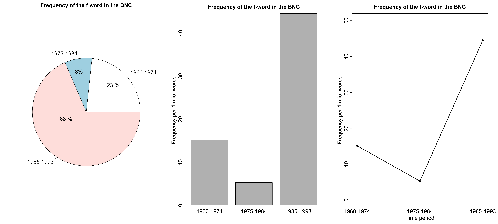

---

## Alternative visualizations

- What kind of variable are we dealing with here?
- Which visualization seems most appropriate to you?

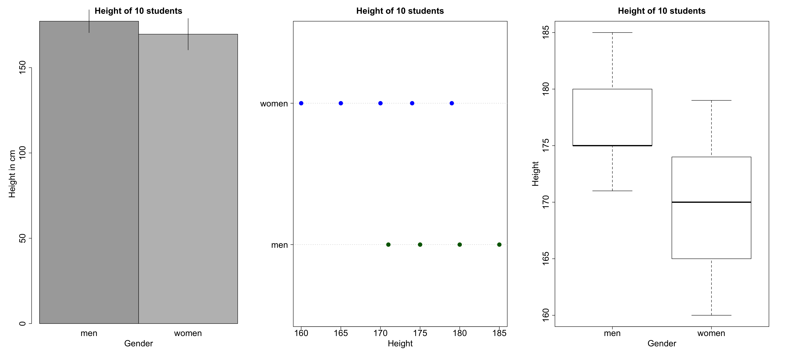

---

## Alternative visualizations

- What kind of variable are we dealing with here?
- Which visualization seems most appropriate to you?


---

## Alternative Visualizations

- from http://www.stubbornmule.net/2010/10/visualizing-smoking-risk/
- "Risk Characterization Theatre" from Rifkin & Bouwer (2007)

<iframe src="fig/rct.html"></iframe>

---
## Alternative Visualizations

- from http://www.stubbornmule.net/2010/10/visualizing-smoking-risk/

</img>

---

## Nominal variable: Alternative visualizations

- Who among the expeRts is a native speaker of English?


---

## The plot as a metaphor

"The essence of a graphic display is that a set of numbers having both magnitudes and an order are represented by an appropriate visual metaphor - the magnitude and order of the metaphorical representation match the numbers." (Wainer 1984: 139)

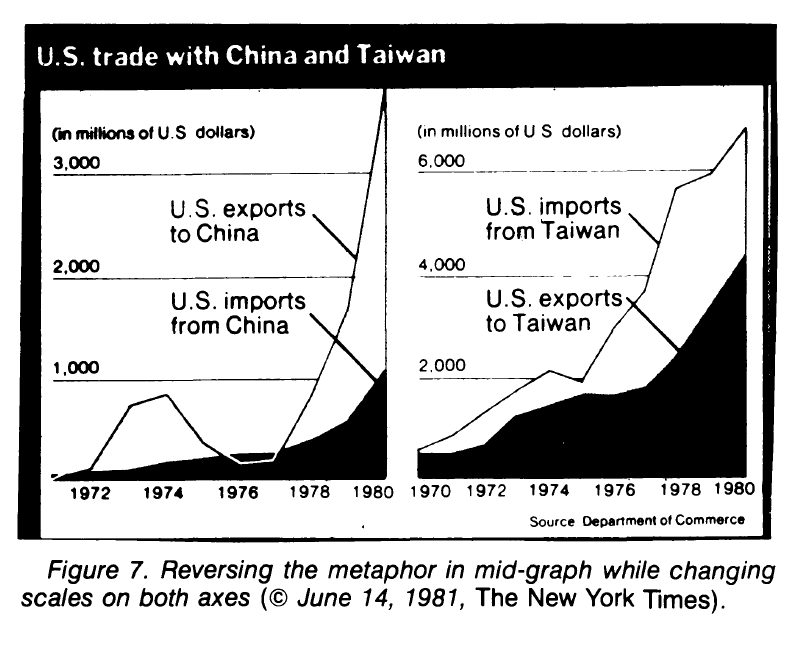</img>

---

## Best practice for reporting and displaying data

> - Most importantly: **Know your data!**
> - When reporting percentages, also report the denominator (i.e. the size of your sample)
> - Example: "50% of academics are alcoholics" - it makes a difference whether your sample size is 2 or 2,000.
> - When reporting comparisons of absolute frequencies, double-check if your samples are comparable.
> - Example: "255 women agree that cats are adorable, but only 5 men." - it makes a difference whether your sample consists of 300 women and 300 men or of 300 women and 10 men.
> - When reporting means, also report standard deviations.
> - Example: [5,5,5,5,995] has the same mean as [1,180,300,223,146].

---

## Best practice (Tufte 2001, Freeman et al. 2009)

> - Show the data
> - Avoid distorting the data
> - Keep "Ink-to-data ratio" as low as possible
> - Use meaningful x and y labels
> - Avoid overplotting (e.g. 3-dimensional plots when only 2 dimensions are displayed)

---

## Beware of overplotting!

</img>
</img>

---

## Further tips

- If there is no natural order in your data, order them by value
<br />


---

## Further tips

- Don't cut the y axis unless there are good conceptual reasons to do so.

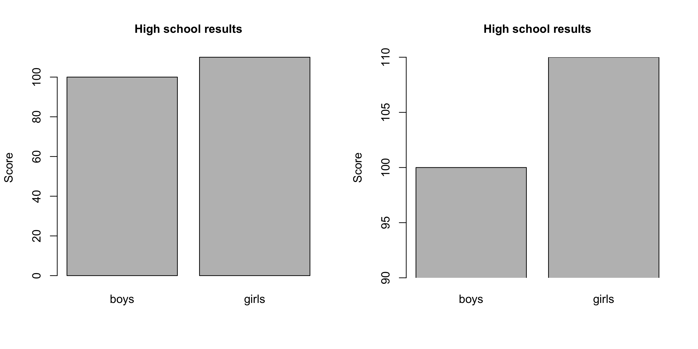

---

## From data to plot

<br />
</img>


---

## Preparing data for visualization

- Use "tidy data": 
  - One variable per column
  - One observation per row

<br />
</img>

---

## "Long" vs. "wide" format

- wide format: repeated responses in a single row
- long format: repeated responses in different rows

</img>

---

## Preparing data for visualization

- Golden rule: **Don't be sloppy with your data!**

</img>

---

## Preparing data for visualization

- Data are often messy: What's wrong here?

</img>

---

## Plot types


---

## Scatterplots: When to use a scatterplot

> - show / explore correlations between two variables
> - metric data on both the x- and the y-axis

---

## Creating a scatterplot

- First, let's create some data:


```r
x <- c(1,3,3,4,7,8)
y <- c(1,1,3,9,8,5)
```

- ... and create a simple plot:


```r
plot(x,y)
```

---

## Creating a scatterplot


---

## Creating a scatterplot

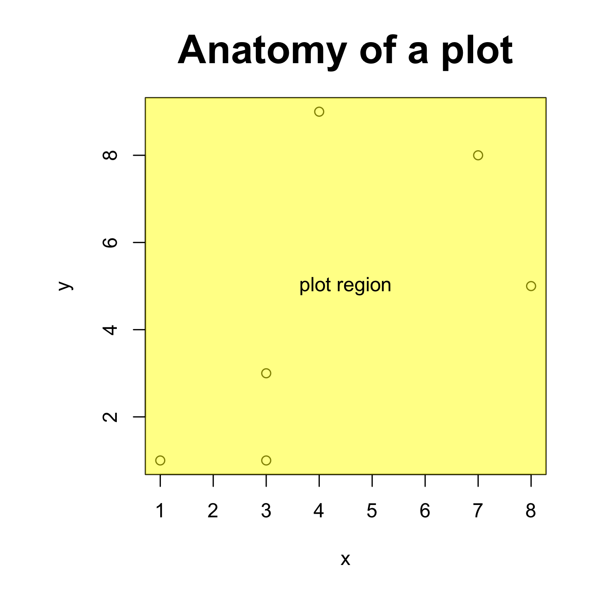

---

## Creating a scatterplot


---

## Creating a scatterplot


---

## Customizing a scatterplot: Labels


```r
plot(x, y, xlab = "xlab", ylab = "ylab", main = "main")
```


---

## Customizing a scatterplot: Colors


```r
plot(x, y, xlab = "xlab", ylab = "ylab", main = "main", col = "red")
```


---

## Customizing a scatterplot: Colors


```r
plot(x, y, xlab = "xlab", ylab = "ylab", main = "main", col = rgb(1, 0, 0, alpha = 0.5))
```

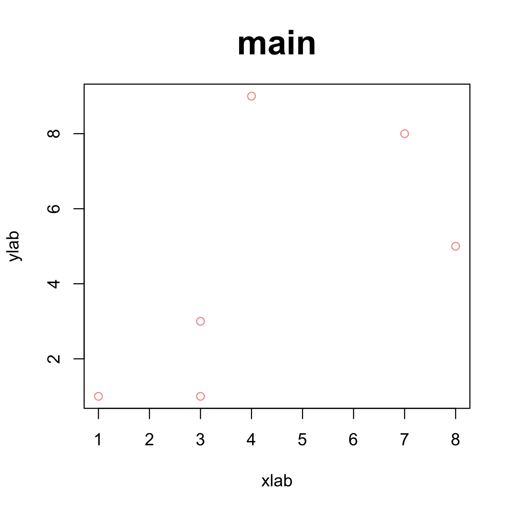

---

## Some notes on color

- keep in mind that what you see on your screen is not always what you get on a printer or projector
- → make sure that your colors are not too similar!
- use color-blind friendly color schemes
- avoid red-green contrasts
- in many cases, it makes sense to combine color with other aesthetics like shape or line type

---


## Some notes on color

- If you work with many different colors in a plot, check out R's color palettes, e.g. `rainbow`, `heat.colors`, `terrain.colors`
- Another useful resource is the `RColorBrewer` package with a number of color-blind friendly palettes (argument `colorblindFriendly = TRUE`)


---

## Customizing a scatterplot: Text


```r
plot(x, y, xlab = "xlab", ylab = "ylab", main = "main", col = "red")
text(x = 5, y = 5,"Note the the added text! \n In a different color!", col = "blue")
```


---

## Customizing a scatterplot: Shapes


```r
plot(x, y, xlab = "xlab", ylab = "ylab", main = "main", col = "red",
     pch = 20)
```


---

## Customizing a scatterplot: Shapes - and sizes


```r
plot(x, y, xlab = "xlab", ylab = "ylab", main = "main", col = "red",
     pch = "\u263A", cex = 2)
```


- Any single character can be used.


```r
par(mar = c(5, 4, 4, 2) + 0.1)
```

---

## Customizing a scatterplot: Shapes


```r
par_cur <- par() # save default graphics parameters
par(mar = c(1,1,1,1)) # change margins
plot(1:20, rep(10,20), pch = c(1:20), cex=1.5, ylab="", xlab="", yaxt="n", xaxt="n")
text(1:20, rep(8.5,20), labels = 1:20)
```


```r
par(par_cur) # restore default graphics parameters
```

---

## Customizing a scatterplot: x and y limits


```r
plot(x, y, xlab = "xlab", ylab = "ylab", main = "main", col = "red",
     xlim = c(0, max(x)),
     ylim = c(0, max(y)))
```


---

## Customizing a scatterplot: grid


```r
plot(x, y, xlab = "xlab", ylab = "ylab", main = "main", col = "red", 
     xlim = c(0, max(x)), ylim = c(0, max(y)))
grid(nx = 0, ny=10)
```

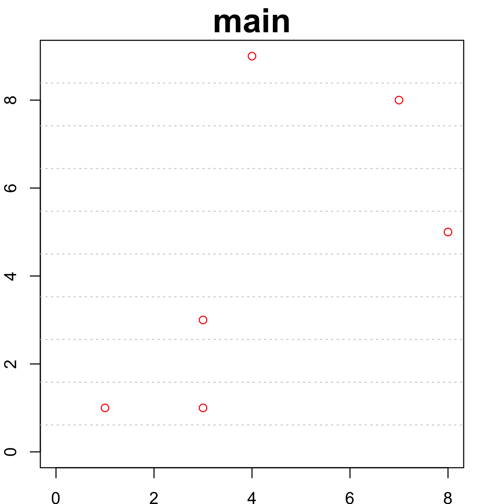

- **Note:** default color is "lightgray", which is often invisible in print
- In many cases grids are a waste of ink.


---

## Customizing a scatterplot: cex parameters


```r
plot(x, y, 
     # cex = 2,
     # cex.axis = 2,
     xlab = "xlab", ylab = "ylab", # cex.lab = 2,
     main = "main", # cex.main = 2,
     xlim = c(0, max(x)), ylim = c(0, max(y)))
```


---

## Customizing a scatterplot: cex parameters


```r
plot(x, y, 
     cex = 2,
     # cex.axis = 2,
     xlab = "xlab", ylab = "ylab", # cex.lab = 2,
     main = "main", # cex.main = 2,
     xlim = c(0, max(x)), ylim = c(0, max(y)))
```


---

## Customizing a scatterplot: cex parameters


```r
plot(x, y, 
     cex = 2,
     cex.axis = 2,
     xlab = "xlab", ylab = "ylab", # cex.lab = 2,
     main = "main", # cex.main = 2,
     xlim = c(0, max(x)), ylim = c(0, max(y)))
```


---

## Customizing a scatterplot: cex parameters


```r
plot(x, y, 
     cex = 2,
     cex.axis = 2,
     xlab = "xlab", ylab = "ylab", cex.lab = 2,
     main = "main", cex.main = 2,
     xlim = c(0, max(x)), ylim = c(0, max(y)))
```


---

## Adding datapoints from another dataframe


```r
plot(x, y, col = "red", pch = 20)
points(x = c(4, 5, 6), y = c(2,6,8), col = "green", pch = 2)
```


---

## Adding a legend


```r
plot(x, y, col = "red", pch = 20)
points(x = c(4, 5, 6), y = c(2,6,8), col = "green", pch = 2)
legend ("topleft", 
        inset = c(0.01,0.01),    # distance from the margins
        pch = c(20,2),           # the two point characters we used
        col = c("red", "green"), # the two colors we used
        legend = c("red dots", "green triangles"))
```

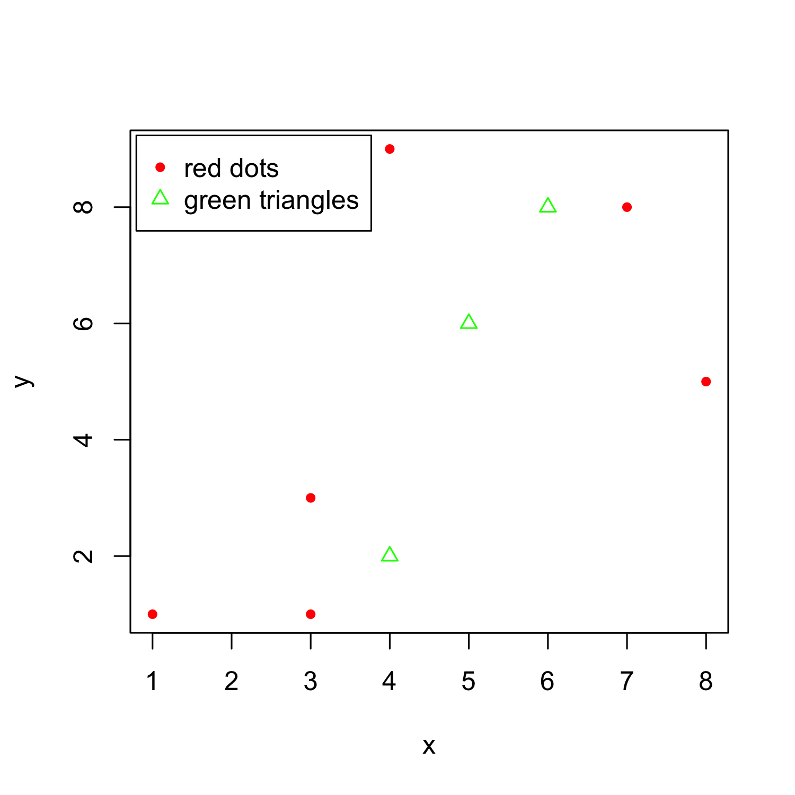

---

## Adding a regression line

- In scatterplots, you often don't see the wood for the trees
- So you might want to visualize a general trend
- To this end, you can add a regression line
- i.e. the straight line that is closest to all points

---

## Adding a regression line

- We use the `lm` function for generating the model and the `abline` function, which adds straight lines to a plot


```r
plot(x, y)
model <- lm(y ~ x)
abline(model)
```


---

## Adding a lo(w)ess curve

- lowess/loess: locally weighted polynomial regression models
- "The basic idea underlying smoothers is to use the observations in a given span
(or bin) of values of X to calculate the average increase in Y . You then move this
span from left to right along the horizontal axis, each time calculating the new
increase in y." (Baayen 2008: 34)

---

## Adding a lo(w)ess curve


```r
plot(x,y, main = "lowess")
lines(lowess(x, y))
scatter.smooth(x,y, main = "loess")
```


---

## From scatterplot to lineplot


```r
plot(x, y, type = "l")
```


---

## From scatterplot to lineplot


```r
plot(x, y, type = "b")
```


---

## From scatterplot to lineplot: Line types

- Line types can be customized using the `lty` parameter:


```r
plot(x, y, type = "b", lty = 2)
lines(x = c(2:7), y = c(4:9), lty = 3, col = "darkgrey")
```

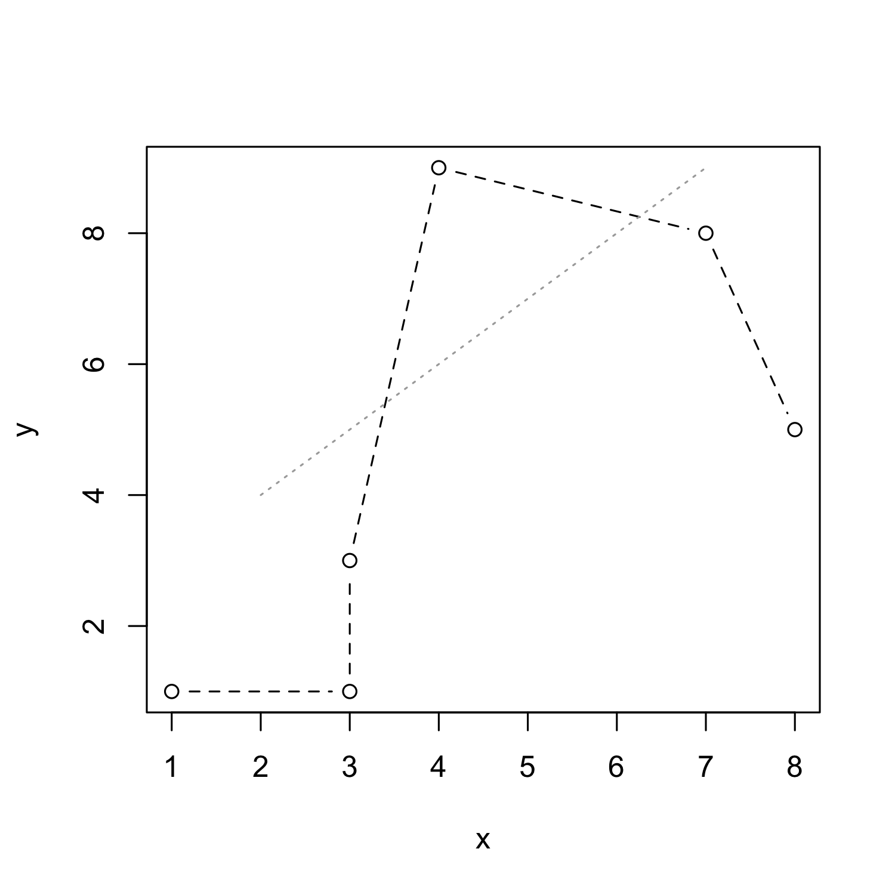

---

## When to use a lineplot

- Lineplots are useful for showing e.g. change over time
- Count variable on y-axis, (at least) ordinal variable on x-axis
- Why should we avoid nominal variables on the x-axis?

---

## When to use a lineplot

- Lineplots are useful for showing e.g. change over time
- Count variable on y-axis, (at least) ordinal variable on x-axis
- Why should we avoid nominal variables on the x-axis?


---

## Hands-on task: Creating a scatterplot

- Use `read.csv` to read in the dataframe height_weight.csv
- Plot height against weight.

---

## Hands-on task: Creating a scatterplot


```r
hw <- read.csv("examples/height_weight.csv")
plot(hw$height, hw$weight, 
     xlab = "Height", ylab = "Weight", main = "Height~Weight")
model_hw <- lm(hw$weight~hw$height)
abline(model_hw, col = "darkgrey", lty = 2)
```

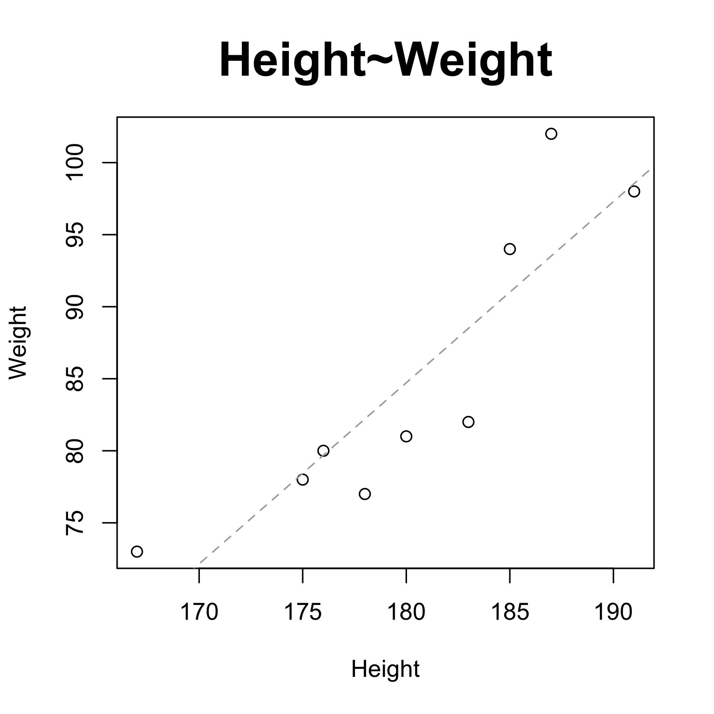

---

## Hands-on task: Creating a more complex scatterplot

- Use `read.csv` to read in the dataframe Pokemon.csv
- Plot height_m against weight_kg.
- Use the `col` parameter to show the color of each Pokémon, as indicated in the "Color" column.
- Use the `pch` parameter to show the form of each Pokémon, as indicated in the "Form" column.
- Hint: For the `pch` part, first look what happens when you try `as.numeric(pok$Form)`
- Finally, add a regression line to the plot.

---

## Hands-on task: Creating a more complex scatterplot


```r
# read data
pok <- read.csv("examples/Pokemon.csv")

# plot
plot(pok$Height_m, pok$Weight_kg, col = pok$Color, pch = as.numeric(pok$Form),
    xlab="Height", ylab="Weight", main = "Height~Weight, Pokémon")
model_pok <- lm(pok$Weight_kg~pok$Height_m)
abline(model_pok)
```

---

## Hands-on task: Creating a more complex scatterplot

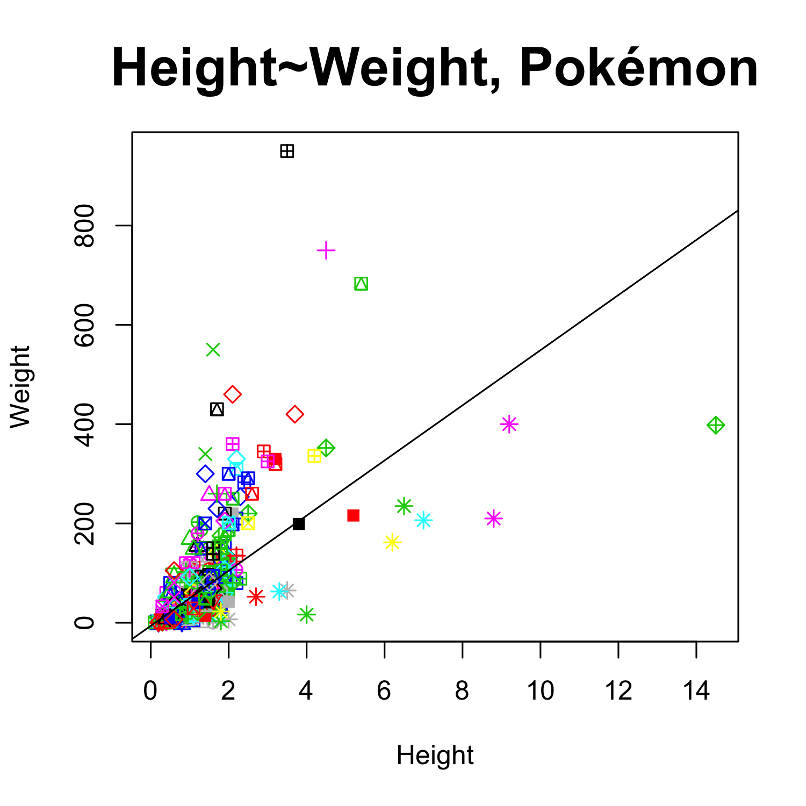

---

## Creating a barplot

- Barplots are useful to show counts of categorical variables (e.g. number of men vs. number of women in parliament)...
- ...or summary statistics (usually: means) of metric variables across different categories (e.g. mean height of humans vs. Klingons)
- But beware: Bar plots can *hide* information, cf. #barbarplots ("Friends don't let friends do bar charts")

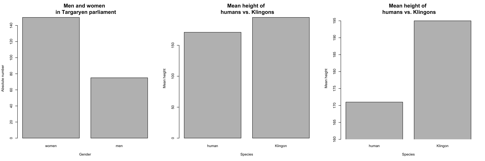

---

## Creating a barplot

- Main argument of the `barplot()` function is `height`
- This can be a vector or a matrix
- Let's try it out:


```r
# define a vector
bar_heights <- c(50, 80)
barplot(bar_heights)
```


---

## Creating a barplot

- The labels of the bars can be specified using `names.arg`:


```r
barplot(bar_heights, names.arg = c("stuff", "more\nstuff"))
```

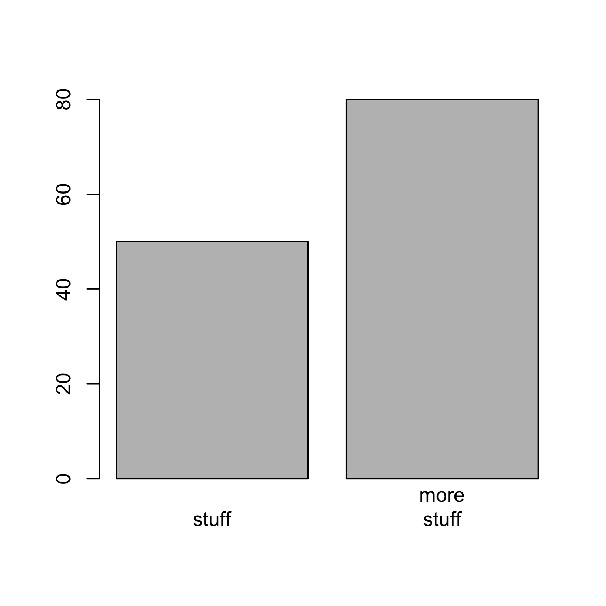

---

## Creating a barplot

- The other arguments are largely the same as in the case of scatterplots:


```r
barplot(bar_heights, names.arg = c("stuff", "more\nstuff"),
        main = "I'm a barplot", xlab = "I'm the x label", ylab = "I'm the y label",
        cex.main = 2, cex.lab = 2, cex.axis = 2, cex.names = 2)
```

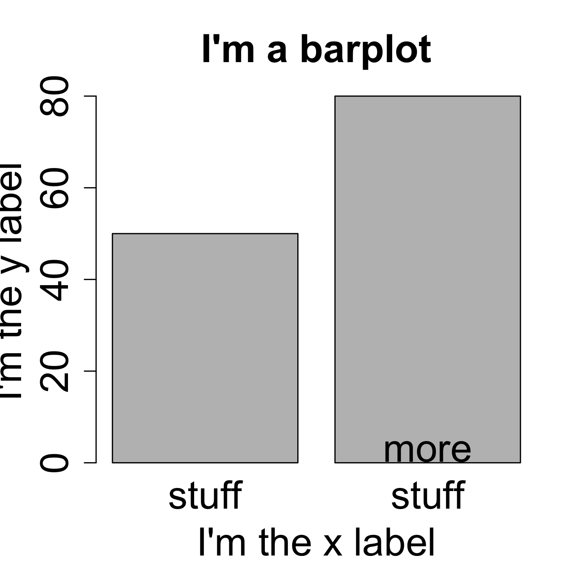

---

## Creating a barplot

- The `space` argument defines the space between bars, default is 0.2 if `height` is a vector


---

## Creating a barplot

- The `space` argument defines the space between bars, default is 0.2 if `height` is a vector

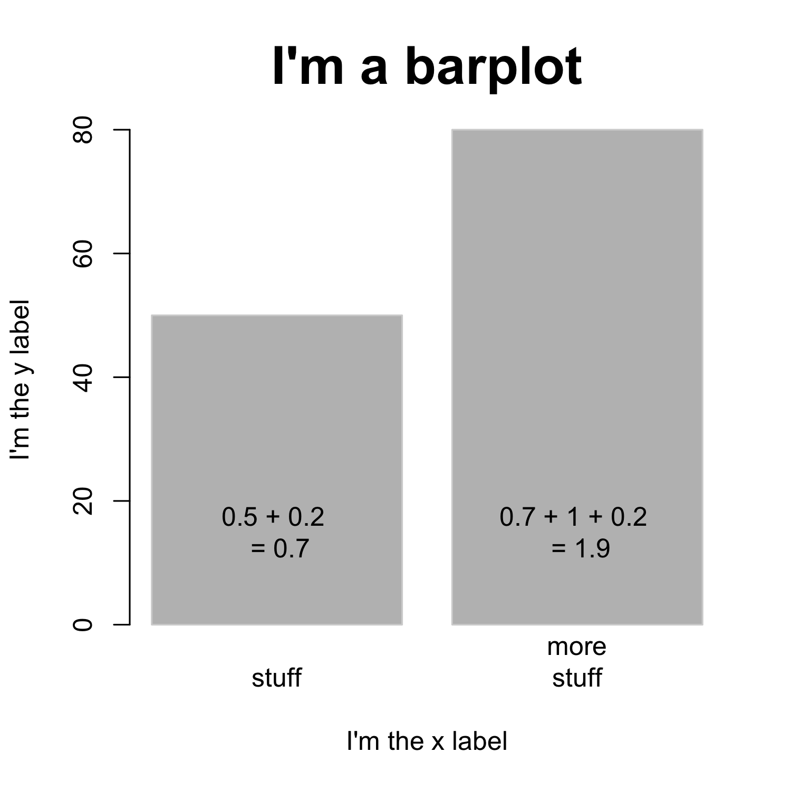

---

## Creating a barplot

- The `space` argument defines the space between bars, default is 0.2 if `height` is a vector

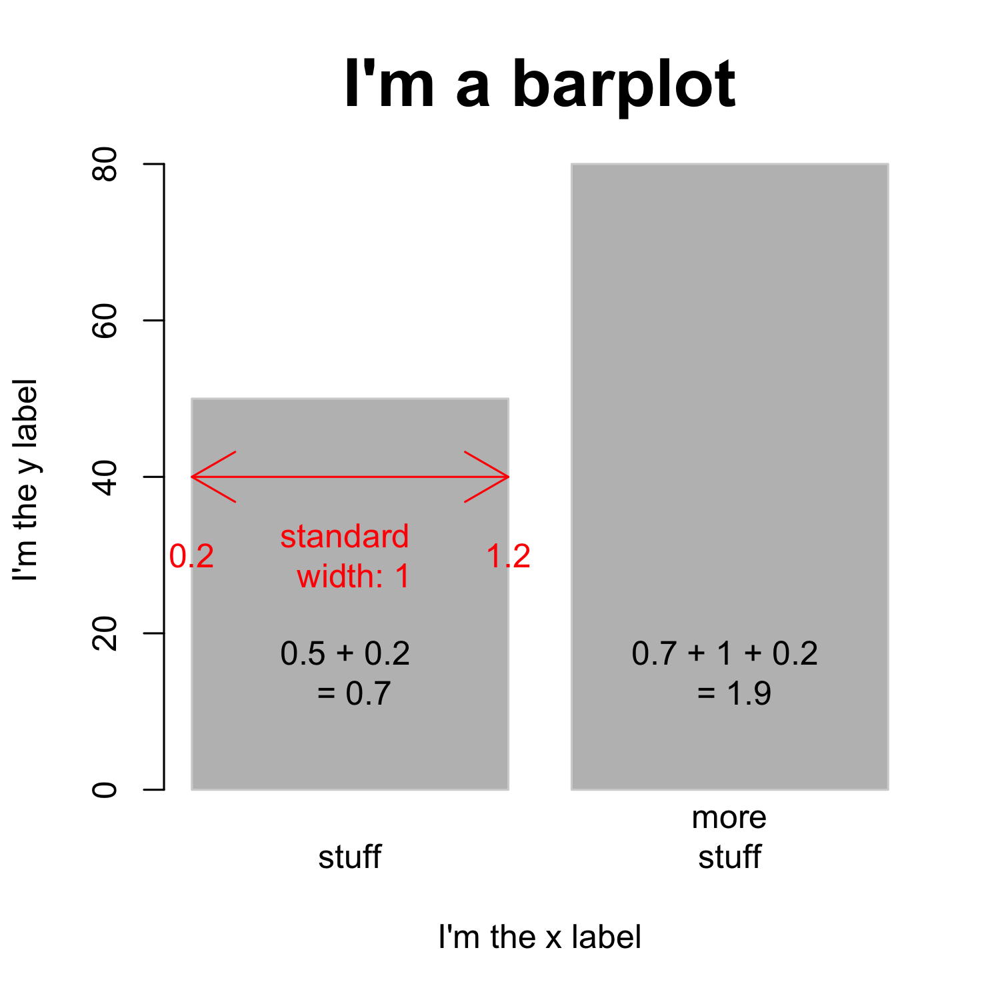

---

## Creating a barplot

- The `space` argument defines the space between bars, default is 0.2 if `height` is a vector


---

## Creating a barplot

- The `space` argument defines the space between bars, default is 0.2 if `height` is a vector


---

## Creating a barplot

- Knowing the width of bars and the space between them is important if you want to add text
- To simplify the task, you can set `space = 0` 


```r
barplot(bar_heights / sum(bar_heights), # get relative frequencies
        names.arg = c("stuff", "more\nstuff"), space = 0)
text(x = c(0:1)+0.5,
     y = (bar_heights / sum(bar_heights)) - 0.05,
     labels = bar_heights)
```


--- bg:#ffffbf

## Creating a barplot

- Or you can use the magic of vector addition and multiplication
- `0.5:1.5` yields {0.5,1.5}, `0.2 * 1:2` yields {0.2, 0.4} (= 0.2 \* 1, 0.2 \* 2)


```r
barplot(bar_heights / sum(bar_heights), # get relative frequencies
        names.arg = c("stuff", "more\nstuff"))
text(x = (0.5:1.5)  + (0.2 * 1:2),
     y = (bar_heights / sum(bar_heights)) - 0.05,
     labels = bar_heights)
```


---

## Creating a barplot from a matrix


```r
bar_matrix <- matrix(c(2,4,5,4,3,3,7,6), nrow = 2)
bar_matrix
```

```
##      [,1] [,2] [,3] [,4]
## [1,]    2    5    3    7
## [2,]    4    4    3    6
```

---

## Creating a barplot from a matrix


```r
barplot(bar_matrix)
```


---

## Generating a barplot from a matrix


```r
barplot(bar_matrix, beside = T)
```

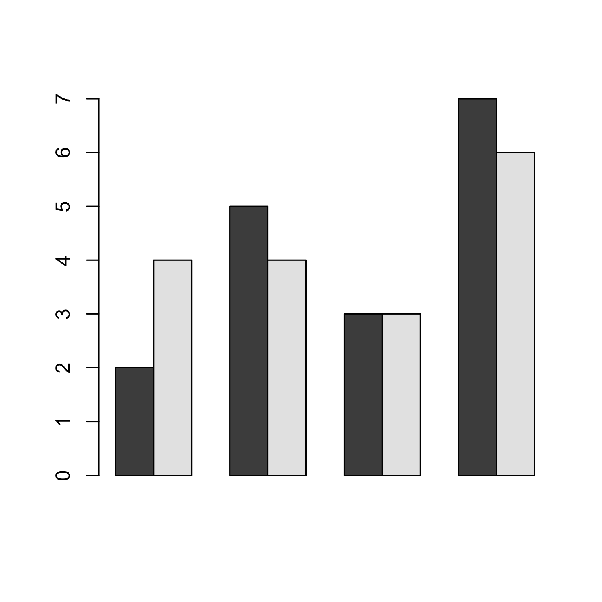

---

## Creating a barplot

Hands-on example: action-sentence compatibility task

<iframe src="/Users/stefanhartmann/Dropbox/Privat/Deutsche Sprachgeschichte/Begleitmaterial/Begleitmaterial_Jan2018/Experimente/actionsentence/actionsentence.html"></iframe>

---

## Hands-on task: Creating a barplot

- Task: Read in file actionsentence.csv with `read.csv`
- Inspect the data using `head`, `str`, and `View`
- Subset the data: Omit rows with `direction == "distractor"`

---

## Hands-on task: Creating a barplot


```r
rt <- read.csv("examples/actionsentence.csv", fileEncoding = "UTF8")
rt <- subset(rt, direction != "distractor")
```

---

## Hands-on task: Creating a barplot

- No we want to show the means for "toward" and "away" sentences using a barplot.
- We want to abstract over the individual subjects, so it makes sense to transpose the table from wide to long format first.


```r
library(reshape2)
rt2 <- melt(rt, id.vars = c("ID", "sentence", "direction"))
```

---

## Hands-on task: Creating a barplot

- No we want to show the means for "toward" and "away" sentences using a barplot.
- We want to abstract over the individual subjects, so it makes sense to transpose the table from wide to long format first.


```r
library(reshape2)
rt2 <- melt(rt, id.vars = c("ID", "sentence", "direction"))

# same result but with (imho) more complicated syntax: "gather" from tidyr package
library(tidyr)
rt3 <- gather(rt, variable, value, -ID, -sentence, -direction)
all(rt2==rt3) # cheks if all values are identical
```

---

## Hands-on task: Creating a barplot

- No we want to show the means for "toward" and "away" sentences using a barplot.
- We want to abstract over the individual subjects, so it makes sense to transpose the table from wide to long format first.


```r
library(reshape2)
rt2 <- melt(rt, id.vars = c("ID", "sentence", "direction"))

# same result but with (imho) more complicated syntax: "gather" from tidyr package
library(tidyr)
rt3 <- gather(rt, variable, value, -ID, -sentence, -direction)
all(rt2==rt3) # cheks if all values are identical
```

```
## [1] TRUE
```

---

## Hands-on task: Creating a barplot


```r
# get mean values for "away" and "towards" subsets:
rt2_away <- subset(rt2, direction == "away")
rt2_toward <- subset(rt2, direction == "toward")

mean_away <- mean(rt2_away$value)
mean_toward <- mean(rt2_toward$value)

# combine both to one vector
rt_means <- c(mean_away, mean_toward)
rt_means
```

```
## [1] 1867.9 1789.5
```

---

## Hands-on task: Creating a barplot


```r
barplot(rt_means, names.arg = c("away", "toward"))
```

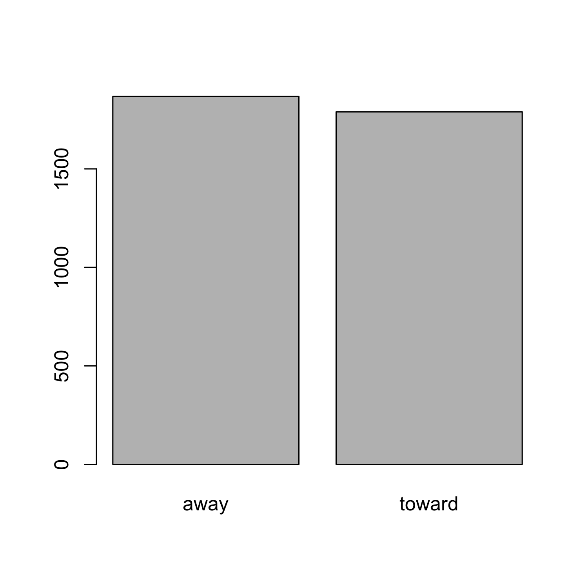

--- bg:#ffffbf

## Barplot: Adding confidence intervals

> - The mean alone doesn't say very much
> - As mentioned before, [5,5,5,5,995] has the same mean as [1,180,300,223,146]
> - This is why researchers tend to add **error bars** to barplots
> - in most cases, these error bars represent 95 % confidence intervals...
> - ... i.e. the interval where we can be 95% confident that it contains the true mean.

--- bg:#ffffbf

## Barplot: adding confidence intervals

- We can obtain the confidence intervals for each of our two means using the `t.test()` function


```r
t_away <- t.test(rt2_away$value)
str(t_away)
```

```
## List of 9
##  $ statistic  : Named num 14.8
##   ..- attr(*, "names")= chr "t"
##  $ parameter  : Named num 29
##   ..- attr(*, "names")= chr "df"
##  $ p.value    : num 4.65e-15
##  $ conf.int   : atomic [1:2] 1610 2126
##   ..- attr(*, "conf.level")= num 0.95
##  $ estimate   : Named num 1868
##   ..- attr(*, "names")= chr "mean of x"
##  $ null.value : Named num 0
##   ..- attr(*, "names")= chr "mean"
##  $ alternative: chr "two.sided"
##  $ method     : chr "One Sample t-test"
##  $ data.name  : chr "rt2_away$value"
##  - attr(*, "class")= chr "htest"
```

--- bg:#ffffbf

## Barplot: adding confidence intervals

- We can use the `arrows` function to plot confidence intervals
- `arrows` is usually used to draw arrows (duh!)
- But these arrows can be customized in very useful ways...


```r
plot(c(1:10), c(1:10), type = "n")
arrows(x0 = 2, x1 = 4,y0 = 5, y1 = 5)
arrows(x0 = 8, x1 = 8, y0 = 5, y1 = 9, 
       angle = 90,  # set angle to 90 degrees = flat arrow head
       code = 3)    # draw arrow head on BOTH ends of the "arrow"
```


--- bg:#ffffbf

## Barplot: adding confidence intervals


```r
ci_away <- t.test(rt2_away$value)$conf.int
ci_toward <- t.test(rt2_toward$value)$conf.int

barplot(rt_means, names.arg = c("away", "toward"))
par(xpd=T)
arrows(x0 = 0.7, x1 = 0.7, y0 = ci_away[1], y1 = ci_away[2], angle = 90, code = 3, length = .2)
arrows(x0 = 1.9, x1 = 1.9, y0 = ci_toward[1], y1 = ci_toward[2], angle = 90, code = 3, length = .2)
```

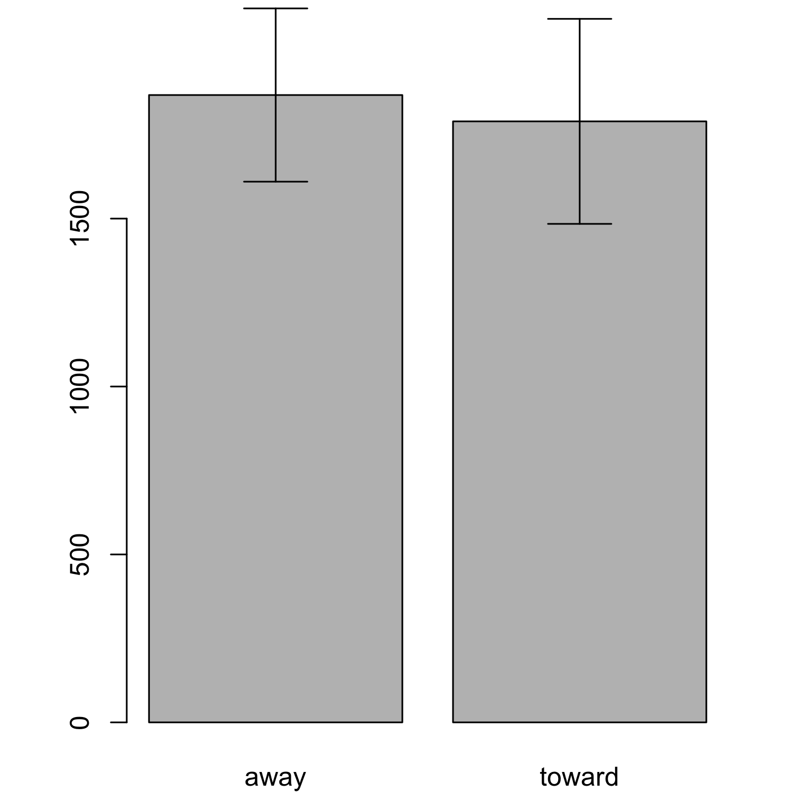


--- bg:#ffffbf

## Hands-on task: Creating a dodged barplot

- Read in the file `avengers.csv`
- Plot the screentimes of Thor and Iron Man in the three Avengers movies as a dodged barplot (i.e. a barplot with side-by-side bars).
- Hint: For a dodged barplot, `barplot()` needs a *matrix* as input. This is a bit tricky - toy around with `matrix()` to create a matrix that looks like this (without the row and column names)


```
##          Avengers1 Avengers2 Avengers3
## Iron Man        37        45        18
## Thor            25        14        14
```

- Another hint: It might help to reorder the data. Using `avengers[order(avengers$character),]` you can sort them by the "character" column.

--- bg:#ffffbf

## Hands-on task: Creating a dodged barplot


```r
# read in data
avengers <- read.csv("examples/avengers.csv")

# sort by "character" column
avengers <- avengers[order(avengers$Character),]
avengers_matrix <- matrix(avengers$Screentime, ncol = 3, byrow = T)
```

--- bg:#ffffbf

## Hands-on task: Creating a dodged barplot


```r
# plot
barplot(avengers_matrix, beside = T, names.arg = c("Avengers 1", "Avengers 2", "Avengers 3"),
        legend.text = c("Iron Man", "Thor"))
```

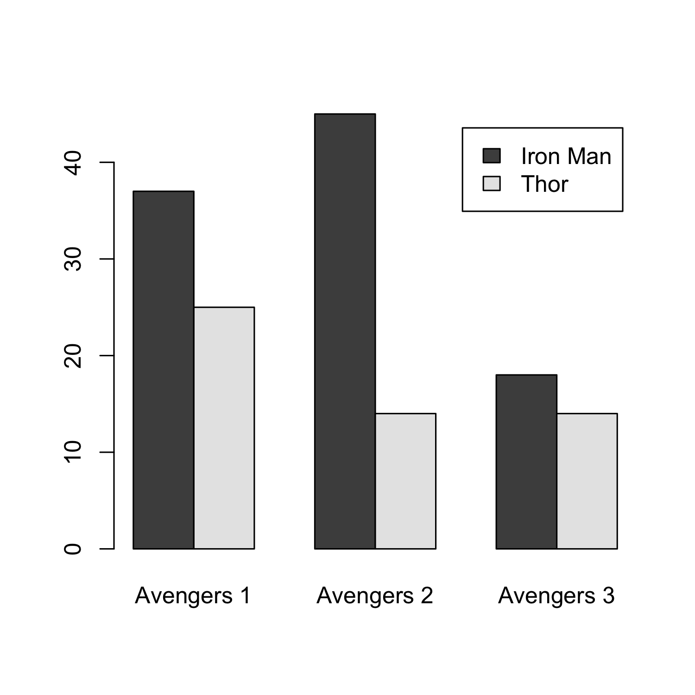

---

## Graphical parameters

With the help of graphical parameters, you can change the appearance of your plot. See `?par` for more information. Some of the most important ones:

> - `mar`: margins.
> - `xpd`: If TRUE, you can plot outside the plot region. If FALSE (the default), plotting is confined to the plot region.
> - `mfrow`: numer of c(rows, columns)
> - `bg`: background color (or no color if you choose "transparent"; default is white)
> - Type `par()` to see the current settings (= the default values if you haven't changed them). This can come in handy if you want to change parameters and then restore the defaults afterwards.
> - You can even store the current values as an object by typing e.g. `par_default <- par()` and later on restore the current settings via `par(par_default)`.

---

## Saving graphs

- In RStudio, you can use the "Export" button in the plot window
- However, the graphics files generated this way have low resolution (72dpi), unless you export an svg image
- This is why you should use `png()`, `tiff()`, `jpeg()`, or `bmp()` instead.


```r
png(filename = "myplot.jpg")
plot(x,y)
dev.off()
```

---

## Saving graphs

- Saving graphs as vector graphics (SVG) has its advantages...
- ... but not all programmes can handle SVG files ☹ 
- Most publishers request PNG or TIFF files (some are also ok with JPG or BMP)

---

## Saving graphs: Layout

- Often you'll want to arrange plots in rows and/or columns
- You have already encountered `par(mfrow=c(nrow,ncol))`
- More complex arrangements are possible with `layout`
- To use this function, you first have to define a *matrix*


```r
m <- matrix(c(1,2,2,
              1,2,2),
           nrow = 2, byrow = T)
```

---

## Saving graphs: Layout


```r
layout(m)
barplot(c(20, 40), names.arg = c("a", "b"))
plot(x = c(7,9,15,24), y = c(8,15, 40, 32), type = "l", ylab="y", xlab="x")
```

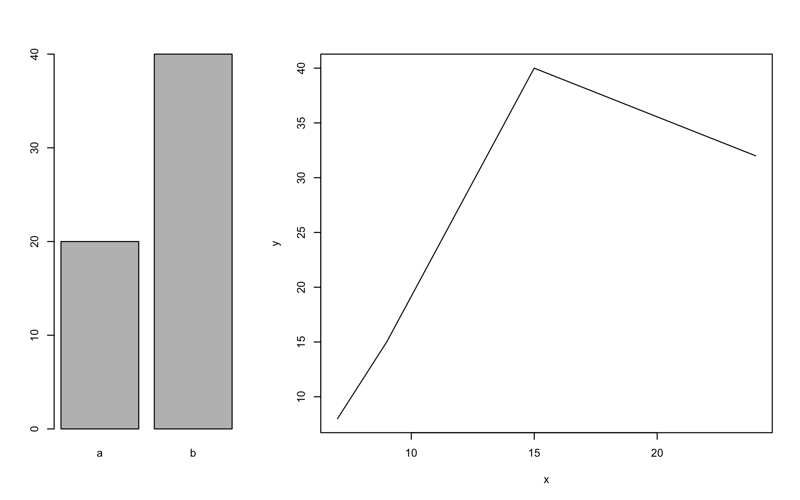

```r
par(par_cur)
```

---

## Saving graphs: Layout

- In order to export the plot, we just add the graphics device commands `png()` (or the like) and `dev.off()`:


```r
png("myfile.png", width = 7, height = 7, un = "in", res = 300)
layout(m)
barplot(c(20, 40), names.arg = c("a", "b"))
plot(x = c(7,9,15,24), y = c(8,15, 40, 32), type = "l", ylab="y", xlab="x")
dev.off()
```

```
## quartz_off_screen 
##                 2
```

```r
par(par_cur)
```

---

## More things to explore

- lattice graphics
- ggplot2
- plotly / shiny for interactive visualizations
- GoogleVis motion charts
- and a lot more!

---

## References

- Baayen, R. Harald. 2008. Analyzing Linguistic Data: A Practical Introduction to Statistics Using R. Cambridge: Cambridge University Press.
- Freeman, Jenny V., Stephen John Walters & Michael J. Campbell. 2008. How to display data. Malden, Mass: BMJ Books.
- Rifkin, Erik & Edward Bouwer. 2007. The illusion of certainty: health benefits and risks. New York, NY: Springer.
- Tufte, Edward R. 2001. The visual display of quantitative information. 2nd ed. Cheshire: Graphics Press.
- Wainer, Howard. 1984. How to display data badly. The American Statistician 28(2). 137–147.


